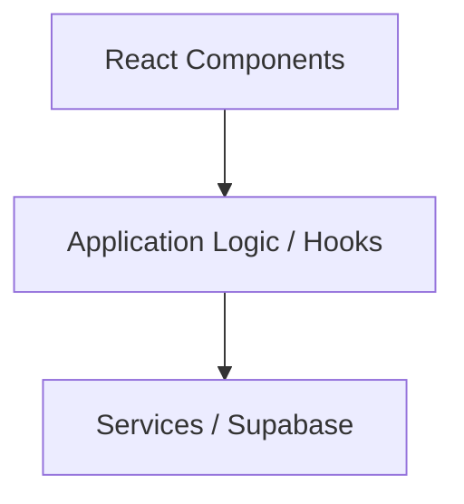
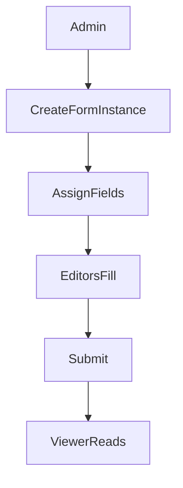

# AGENTS.md

## Project Overview
Internal web application for structured form creation, collaborative form filling, and reporting.

Primary roles:
- Root Admin
- Admin
- Editor
- Viewer

Focus:
- MVP-first
- Simplicity
- Maintainability
- Fast iteration

---

# Technology Stack

Frontend
- Vite 7
- React 19
- TypeScript 5.9
- Shadcn UI
- TailwindCSS

Backend
- Supabase (configured via MCP in `opencode.json`)

Database
- PostgreSQL

Package manager
- npm (ESM project: `"type": "module"`)

Design
- Figma (via MCP)

System diagrams
- Mermaid

---

# Build / Lint / Test Commands

```bash
# Development server
npm run dev

# Production build (type-checks then bundles)
npm run build
# Equivalent to: tsc -b && vite build

# Type-check only (no emit)
npx tsc -b

# Lint all files
npm run lint

# Preview production build locally
npm run preview
```

## Testing

When tests are added, use **Vitest** with React Testing Library:

```bash
# Run all tests
npx vitest run

# Run tests in watch mode
npx vitest

# Run a single test file
npx vitest run src/components/MyComponent.test.tsx

# Run tests matching a name pattern
npx vitest run -t "should render form"
```

Place test files next to the source file they test using `.test.tsx` / `.test.ts`
(e.g., `src/components/Button.tsx` -> `src/components/Button.test.tsx`).

---

# Core Development Principles

## 1. KISS (Keep It Simple)

Always prefer the simplest working solution.

Avoid:
- unnecessary abstractions
- premature optimization
- complex patterns without clear need

Prefer:
- simple functions
- readable logic
- small modules

If two solutions exist, choose the least complex.

## 2. Lightweight Clean Architecture

Use clean architecture conceptually, not dogmatically.

Layers:



Rules:

- UI must not directly query the database
- Business logic should live outside components
- Infrastructure logic belongs in services

Do not create unnecessary layers.

## 3. Senior Engineer Behavior

The agent must behave like a very experienced full-stack developer.

The agent must:
- challenge assumptions
- detect flawed architecture
- avoid blindly agreeing
- evaluate tradeoffs

If a request is questionable:
1. Explain the issue
2. Propose an alternative
3. Explain the impact

## 4. Confidence Reporting

Every technical answer must end with:

Confidence: Low | Medium | High

Low → insufficient information
Medium → reasonable assumptions
High → strong confidence

## 5. Options When Requested

When the user asks for options, provide:

Option A
Option B
Option C (if relevant)

Each option must include:
- implementation approach
- pros
- cons
- complexity

---

# TypeScript Configuration & Code Style

## Compiler Options (tsconfig.app.json)

Project uses **strict TypeScript** with project references:
- `tsconfig.json` - root (references only)
- `tsconfig.app.json` - application code in `src/`
- `tsconfig.node.json` - tooling (vite.config.ts)

Key settings:

| Option | Value | Note |
|---|---|---|
| `strict` | `true` | All strict checks enabled |
| `target` | `ES2022` | Modern JS output |
| `jsx` | `react-jsx` | Automatic JSX transform (no React import needed for JSX) |
| `verbatimModuleSyntax` | `true` | **Must use `import type` for type-only imports** |
| `noUnusedLocals` | `true` | No unused variables allowed |
| `noUnusedParameters` | `true` | No unused parameters allowed |
| `erasableSyntaxOnly` | `true` | No enums or namespaces with runtime behavior |

### Critical: `verbatimModuleSyntax`

Always use explicit `type` keyword for type-only imports:

```typescript
// CORRECT
import type { FormData } from './types'
import { useState, type Dispatch } from 'react'

// WRONG - will cause build errors
import { FormData } from './types'  // if FormData is only a type
```

## ESLint

Uses ESLint 9 flat config (`eslint.config.js`) with:
- `@eslint/js` recommended rules
- `typescript-eslint` recommended rules
- `eslint-plugin-react-hooks` (enforces Rules of Hooks)
- `eslint-plugin-react-refresh` (ensures HMR-compatible exports)

Only `**/*.{ts,tsx}` files are linted. `dist/` is globally ignored.

## Formatting

- **Single quotes** for strings
- **No semicolons**
- **2-space indentation**
- Template literals for interpolation

## Import Order

Order imports in this sequence, separated by blank lines:
1. React / React DOM
2. Third-party libraries
3. Local modules (include `.tsx` / `.ts` extensions in relative imports)
4. CSS / asset side-effect imports

```typescript
import { useState, useEffect } from 'react'

import { supabase } from '../services/supabase'

import type { FormField } from '../types'
import { FormInput } from './FormInput.tsx'

import './Form.css'
```

## Component Conventions

- Use **function declarations**: `function MyComponent() {}`
- **Default exports** for page/route-level components
- **Named exports** for shared/reusable components
- **Fragment shorthand** when no wrapper needed: `<>...</>`
- One component per file

## Naming Conventions

| Item | Convention | Example |
|---|---|---|
| Components | PascalCase | `FormBuilder.tsx` |
| Hooks | camelCase, `use` prefix | `useFormState.ts` |
| Utilities | camelCase | `validateField.ts` |
| Types / Interfaces | PascalCase | `FormField` |
| Constants | UPPER_SNAKE_CASE | `MAX_FIELD_COUNT` |
| Test files | `.test.tsx` / `.test.ts` | `FormBuilder.test.tsx` |
| Directories | kebab-case | `src/features/` |
| DB columns/tables | snake_case | `form_template`, `created_at` |

## Types

- Prefer `interface` for object shapes that may be extended
- Prefer `type` for unions, intersections, and utility types
- **No `enum`** -- use `as const` objects or union types:

```typescript
// CORRECT
const FormFieldType = {
  TEXT: 'text',
  NUMBER: 'number',
  SELECT: 'select',
} as const
type FormFieldType = (typeof FormFieldType)[keyof typeof FormFieldType]

// WRONG - will not compile
enum FormFieldType { TEXT, NUMBER, SELECT }
```

## Error Handling

- try/catch for async operations (Supabase queries, fetch)
- Always handle Supabase `error` responses explicitly
- Prefer early returns for guard clauses

```typescript
const { data, error } = await supabase.from('forms').select('*')
if (error) throw error
return data
```

---

# Frontend Structure

```
src/
  components/    # Reusable UI components
  features/      # Feature modules
  hooks/         # Custom React hooks
  services/      # Supabase / API access
  lib/           # Utilities
  types/         # Shared TypeScript types
```

---

# React Rules

Use:
- Functional components
- Hooks
- Strict TypeScript

Avoid:
- class components
- unnecessary global state
- `React.FC` (prefer explicit prop types with function declarations)

State priority:

1. Local state
2. Server state (Tanstack Query if needed)
3. Global state only if unavoidable

---

# UI Rules

Use Shadcn UI components whenever possible.

Avoid custom UI components if Shadcn provides them.

Consistency rules:

- Tailwind for spacing and styling
- No inline styles
- Follow existing component patterns

---

# MCP Tool Usage

The agent must use MCP servers when relevant.

## Figma MCP

Use when:
- designs are referenced
- UI must match Figma
- layout decisions depend on designs

Do not guess design details if Figma is available.

## Supabase MCP

Use for:
- database queries
- schema design
- migrations
- authentication
- backend communication

---

# Database Rules

Database: PostgreSQL

Rules:

- use parameterized queries
- avoid N+1 queries
- prefer indexed filters
- avoid unnecessary joins
- snake_case for all naming

---

# Form System Concepts

Core objects:

Form Template
Defines structure and fields.

Form Instance
Runtime copy of a template.

Field Assignment
Controls which user edits a field.

Versioning
Snapshot per submission.

Rules:

- Templates become immutable after use
- Instances maintain version history
- Only assigned users edit locked fields

---

# Collaboration Model

Forms use save-based collaboration. No real-time editing.



---

# Security

Must enforce:

- server-side RBAC
- field-level access control
- role validation
- input sanitization

Never trust frontend validation.

---

# Performance Targets

Dashboard load: < 2 seconds on 4G
Exports: <= 10,000 rows

Prefer:
- pagination
- indexed queries
- minimal payloads

---

# What NOT To Do

Do not:
- introduce unnecessary frameworks
- over-engineer architecture
- create abstractions without need
- duplicate business logic
- build unused systems
- use `enum` (use `as const` instead)
- skip `import type` for type-only imports
- write inline styles when Tailwind classes exist

---

# Environment & Tooling

- **Node.js**: v25+
- **Module system**: ESM (`"type": "module"`)
- **Vite dev server**: HMR via `@vitejs/plugin-react`
- **No path aliases** -- use relative imports
- **`.env` files** are gitignored; prefix Vite-exposed vars with `VITE_`
- Use `opencode.json` for MCP config; never redefine MCP connections manually

---

# Agent Behavior Summary

The agent must prioritize:

clarity > cleverness
simplicity > abstraction
shipping > perfection

Act like a pragmatic senior full-stack engineer.

Focus on: simplicity, maintainability, correctness, practical solutions.
