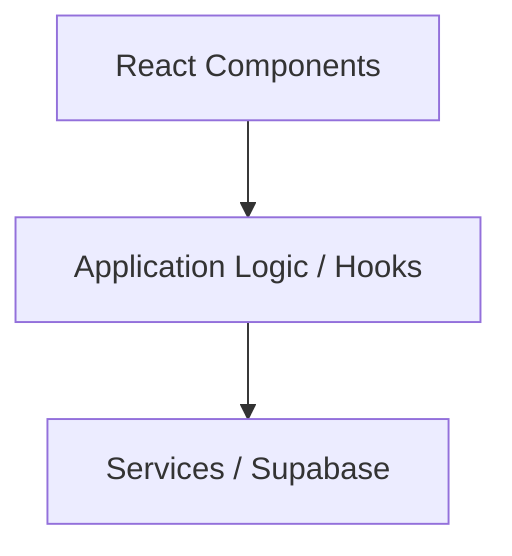
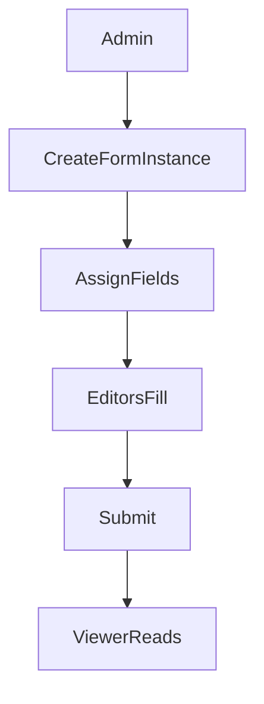

# AGENTS.md

## Project Overview
Internal web application for structured form creation, collaborative form filling, and reporting.

Primary roles:
- Root Admin
- Admin
- Editor
- Viewer

Focus:
- MVP-first
- Simplicity
- Maintainability
- Fast iteration

---

# Technology Stack

Frontend
- Vite 7
- React 19
- TypeScript 5.9
- Shadcn UI
- TailwindCSS

Backend
- Supabase (configured via MCP in `opencode.json`)
- Supabase CLI for local development (`supabase/` directory)

Database
- PostgreSQL

Package manager
- npm (ESM project: `"type": "module"`)
- Always install the **latest stable version** of packages (`npm install package@latest`)
- Never pin to outdated versions without an explicit reason
- Before adding a new package, check its current version and changelog via Context7 or npm

Design
- Figma (via MCP)

System diagrams
- Mermaid

---

# Build / Lint / Test Commands

```bash
# Development server
npm run dev

# Production build (type-checks then bundles)
npm run build
# Equivalent to: tsc -b && vite build

# Type-check only (no emit)
npx tsc -b

# Lint all files
npm run lint

# Preview production build locally
npm run preview
```

## Testing

When tests are added, use **Vitest** with React Testing Library:

```bash
# Run all tests
npx vitest run

# Run tests in watch mode
npx vitest

# Run a single test file
npx vitest run src/components/MyComponent.test.tsx

# Run tests matching a name pattern
npx vitest run -t "should render form"
```

Place test files next to the source file they test using `.test.tsx` / `.test.ts`
(e.g., `src/components/Button.tsx` -> `src/components/Button.test.tsx`).

---

# Core Development Principles

## 1. KISS (Keep It Simple)

Always prefer the simplest working solution.

Avoid:
- unnecessary abstractions
- premature optimization
- complex patterns without clear need

Prefer:
- simple functions
- readable logic
- small modules

If two solutions exist, choose the least complex.

## 2. Lightweight Clean Architecture

Use clean architecture conceptually, not dogmatically.

Layers:



Rules:

- UI must not directly query the database
- Business logic should live outside components
- Infrastructure logic belongs in services

Do not create unnecessary layers.

## 3. Senior Engineer Behavior

The agent must behave like a very experienced full-stack developer.

The agent must:
- challenge assumptions
- detect flawed architecture
- avoid blindly agreeing
- evaluate tradeoffs

If a request is questionable:
1. Explain the issue
2. Propose an alternative
3. Explain the impact

## 4. Confidence Reporting

Every technical answer must end with:

Confidence: Low | Medium | High

Low → insufficient information
Medium → reasonable assumptions
High → strong confidence

## 5. Options When Requested

When the user asks for options, provide:

Option A
Option B
Option C (if relevant)

Each option must include:
- implementation approach
- pros
- cons
- complexity

---

# TypeScript Configuration & Code Style

## Compiler Options (tsconfig.app.json)

Project uses **strict TypeScript** with project references:
- `tsconfig.json` - root (references only)
- `tsconfig.app.json` - application code in `src/`
- `tsconfig.node.json` - tooling (vite.config.ts)

Key settings:

| Option | Value | Note |
|---|---|---|
| `strict` | `true` | All strict checks enabled |
| `target` | `ES2022` | Modern JS output |
| `jsx` | `react-jsx` | Automatic JSX transform (no React import needed for JSX) |
| `verbatimModuleSyntax` | `true` | **Must use `import type` for type-only imports** |
| `noUnusedLocals` | `true` | No unused variables allowed |
| `noUnusedParameters` | `true` | No unused parameters allowed |
| `erasableSyntaxOnly` | `true` | No enums or namespaces with runtime behavior |

### Critical: `verbatimModuleSyntax`

Always use explicit `type` keyword for type-only imports:

```typescript
// CORRECT
import type { FormData } from './types'
import { useState, type Dispatch } from 'react'

// WRONG - will cause build errors
import { FormData } from './types'  // if FormData is only a type
```

## ESLint

Uses ESLint 9 flat config (`eslint.config.js`) with:
- `@eslint/js` recommended rules
- `typescript-eslint` recommended rules
- `eslint-plugin-react-hooks` (enforces Rules of Hooks)
- `eslint-plugin-react-refresh` (ensures HMR-compatible exports)

Only `**/*.{ts,tsx}` files are linted. `dist/` is globally ignored.

## Formatting

- **Single quotes** for strings
- **No semicolons**
- **2-space indentation**
- Template literals for interpolation

## Import Order

Order imports in this sequence, separated by blank lines:
1. React / React DOM
2. Third-party libraries
3. Local modules (include `.tsx` / `.ts` extensions in relative imports)
4. CSS / asset side-effect imports

```typescript
import { useState, useEffect } from 'react'

import { supabase } from '../services/supabase'

import type { FormField } from '../types'
import { FormInput } from './FormInput.tsx'

import './Form.css'
```

## Component Conventions

- Use **function declarations**: `function MyComponent() {}`
- **Default exports** for page/route-level components
- **Named exports** for shared/reusable components
- **Fragment shorthand** when no wrapper needed: `<>...</>`
- One component per file

## Naming Conventions

| Item | Convention | Example |
|---|---|---|
| Components | PascalCase | `FormBuilder.tsx` |
| Hooks | camelCase, `use` prefix | `useFormState.ts` |
| Utilities | camelCase | `validateField.ts` |
| Types / Interfaces | PascalCase | `FormField` |
| Constants | UPPER_SNAKE_CASE | `MAX_FIELD_COUNT` |
| Test files | `.test.tsx` / `.test.ts` | `FormBuilder.test.tsx` |
| Directories | kebab-case | `src/features/` |
| DB columns/tables | snake_case | `form_template`, `created_at` |

## Types

- Prefer `interface` for object shapes that may be extended
- Prefer `type` for unions, intersections, and utility types
- **No `enum`** -- use `as const` objects or union types:

```typescript
// CORRECT
const FormFieldType = {
  TEXT: 'text',
  NUMBER: 'number',
  SELECT: 'select',
} as const
type FormFieldType = (typeof FormFieldType)[keyof typeof FormFieldType]

// WRONG - will not compile
enum FormFieldType { TEXT, NUMBER, SELECT }
```

## Error Handling

- try/catch for async operations (Supabase queries, fetch)
- Always handle Supabase `error` responses explicitly
- Prefer early returns for guard clauses

```typescript
const { data, error } = await supabase.from('forms').select('*')
if (error) throw error
return data
```

---

# Frontend Structure

```
src/
  components/    # Reusable UI components
  features/      # Feature modules
  hooks/         # Custom React hooks
  services/      # Supabase / API access
  lib/           # Utilities
  types/         # Shared TypeScript types
```

---

# React Rules

Use:
- Functional components
- Hooks
- Strict TypeScript

Avoid:
- class components
- unnecessary global state
- `React.FC` (prefer explicit prop types with function declarations)

State priority:

1. Local state
2. Server state (Tanstack Query if needed)
3. Global state only if unavoidable

---

# UI Rules

Use Shadcn UI components whenever possible.

Avoid custom UI components if Shadcn provides them.

Consistency rules:

- Tailwind for spacing and styling
- No inline styles
- Follow existing component patterns

---

# MCP Tool Usage

The agent must use MCP servers when relevant.

## Figma MCP

Use when:
- designs are referenced
- UI must match Figma
- layout decisions depend on designs

Do not guess design details if Figma is available.

## Supabase MCP

The Supabase MCP connection will be pointed at the **local Supabase** instance. Use Supabase MCP tools as the **primary interface** for all database work.

Use for:
- **creating tables, columns, indexes, triggers, functions** via `supabase_apply_migration`
- **writing and applying RLS policies** via `supabase_apply_migration`
- **running ad-hoc queries** (data inspection, debugging) via `supabase_execute_sql`
- **listing tables and schema** via `supabase_list_tables`
- **listing and checking migrations** via `supabase_list_migrations`
- **generating TypeScript types** via `supabase_generate_typescript_types`
- **checking advisors** (security, performance) via `supabase_get_advisors` after DDL changes
- Edge Function management via `supabase_deploy_edge_function`, `supabase_list_edge_functions`, `supabase_get_edge_function`

**Migration workflow:**
1. Use `supabase_apply_migration` for every schema change -- this creates a proper timestamped migration file and applies it
2. Never write raw SQL migration files manually; always go through the MCP tool
3. After applying migrations, run `supabase_get_advisors` (security) to catch missing RLS policies
4. Use `supabase_generate_typescript_types` after schema changes to keep frontend types in sync
5. Use `supabase_list_tables` (verbose) to verify the schema looks correct after migrations

## Context7 MCP

**Always use Context7 MCP proactively** — do not wait to be asked.

Use whenever:
- installing or adding a new library or package
- writing code that uses a third-party API or SDK
- following setup or configuration steps for any tool
- generating code patterns for a library (hooks, clients, middleware, etc.)
- unsure about the correct API surface for a dependency

Context7 provides up-to-date, version-accurate documentation pulled directly from the library source. It prevents hallucinated APIs and outdated usage patterns.

Never rely on training data alone for library-specific code. Always resolve docs via Context7 first.

---

# Database Rules

Database: PostgreSQL

Rules:

- use parameterized queries
- avoid N+1 queries
- prefer indexed filters
- avoid unnecessary joins
- snake_case for all naming

---

# Form System Concepts

Core objects:

Form Template
Defines structure and fields.

Form Instance
Runtime copy of a template.

Field Assignment
Controls which user edits a field.

Versioning
Snapshot per submission.

Rules:

- Templates become immutable after use
- Instances maintain version history
- Only assigned users edit locked fields

---

# Collaboration Model

Forms use save-based collaboration. No real-time editing.



---

# Security

Must enforce:

- server-side RBAC
- field-level access control
- role validation
- input sanitization

Never trust frontend validation.

---

# Performance Targets

Dashboard load: < 2 seconds on 4G
Exports: <= 10,000 rows

Prefer:
- pagination
- indexed queries
- minimal payloads

---

# What NOT To Do

Do not:
- introduce unnecessary frameworks
- over-engineer architecture
- create abstractions without need
- duplicate business logic
- build unused systems
- use `enum` (use `as const` instead)
- skip `import type` for type-only imports
- write inline styles when Tailwind classes exist

---

# Git Commits & Versioning

## Conventional Commits

All commits must follow the [Conventional Commits](https://www.conventionalcommits.org/) specification.

Format:

```
<type>(<scope>): <description>

[optional body]

[optional footer(s)]
```

Allowed types:

| Type | When to use |
|---|---|
| `feat` | New feature |
| `fix` | Bug fix |
| `docs` | Documentation changes only |
| `style` | Formatting, whitespace (no logic change) |
| `refactor` | Code change that is neither a fix nor a feature |
| `test` | Adding or updating tests |
| `chore` | Build process, tooling, dependencies |
| `perf` | Performance improvement |
| `ci` | CI/CD configuration changes |
| `revert` | Reverts a previous commit |

Examples:

```
feat(forms): add field assignment to form instances
fix(auth): redirect unauthenticated users to login
chore(deps): update vite to v7.1.0
docs(agents): add commit and versioning guidelines
```

## Atomic Commits

Every commit must represent one logical, self-contained change.

Rules:
- One concern per commit — do not mix features, fixes, and refactors
- Commits must pass build and lint at every point in history
- Never bundle unrelated changes to make committing easier
- If a change feels too large, split it into smaller commits

This ensures any commit can be safely reverted without side effects.

## Versioning

Uses [Semantic Versioning](https://semver.org/) (`MAJOR.MINOR.PATCH`) driven by conventional commits:

| Version bump | Trigger |
|---|---|
| `PATCH` (0.0.x) | `fix`, `perf`, `refactor`, `docs`, `chore` |
| `MINOR` (0.x.0) | `feat` |
| `MAJOR` (x.0.0) | Any commit with `BREAKING CHANGE:` in the footer |

### Git Tags

Tag every release:

```bash
# Create an annotated tag
git tag -a v1.2.0 -m "feat(forms): add collaborative field assignment"

# Push tag to remote
git push origin v1.2.0

# Push all tags
git push origin --tags
```

Tag naming: `v<MAJOR>.<MINOR>.<PATCH>` (e.g., `v0.1.0`, `v1.0.0`)

### GitHub Releases

Create a GitHub release for every tag:
- Use the tag as the release title (e.g., `v0.1.0`)
- Release notes must summarise all commits since the previous tag, grouped by type (`feat`, `fix`, etc.)
- Mark pre-1.0 releases as **pre-release**

### Starting Version

Project starts at `v0.1.0`. Version `v1.0.0` is cut when the MVP is considered production-ready.

---

# Environment & Tooling

- **Node.js**: v25+
- **Module system**: ESM (`"type": "module"`)
- **Vite dev server**: HMR via `@vitejs/plugin-react`
- **Path alias**: `@/` maps to `./src/` (required by Shadcn UI). Use it for Shadcn imports; prefer relative imports elsewhere.
- **`.env` files** are gitignored; prefix Vite-exposed vars with `VITE_`
- Use `opencode.json` for MCP config; never redefine MCP connections manually

---

# Supabase Local Development Workflow

## Setup

The project uses **local Supabase** via the Supabase CLI with Docker. All database schema, migrations, Edge Functions, and seed data live in the `supabase/` directory under version control.

```
supabase/
  config.toml              # Local Supabase configuration
  migrations/              # SQL migration files (timestamped, versioned)
  functions/               # Edge Functions source code (Deno/TypeScript)
  seed.sql                 # Seed data (Root Admin bootstrap, test data)
```

## Commands

```bash
# Start local Supabase (requires Docker)
supabase start

# Stop local Supabase
supabase stop

# Check local Supabase status
supabase status

# Create a new migration
supabase migration new <migration_name>

# Apply migrations to local database
supabase db reset

# Push migrations to remote Supabase project
supabase db push

# Pull remote schema changes (if any were made via dashboard)
supabase db pull

# Deploy all Edge Functions to remote
supabase functions deploy

# Deploy a specific Edge Function
supabase functions deploy <function_name>

# Serve Edge Functions locally for testing
supabase functions serve

# Generate TypeScript types from local schema
supabase gen types typescript --local > src/types/database.ts

# View local database diff (uncommitted schema changes)
supabase db diff
```

## Development Workflow

1. **Start local Supabase** before development: `supabase start`
2. **Create migrations via Supabase MCP** using `supabase_apply_migration` for all schema changes
   - Never write raw SQL migration files manually -- always use the MCP tool
   - The MCP tool creates proper timestamped migration files and applies them automatically
   - After applying, run `supabase_get_advisors` (security) to catch missing RLS policies
3. **Write Edge Functions** in `supabase/functions/<function-name>/index.ts`
4. **Test locally** with `supabase functions serve` and `supabase db reset`
5. **Generate types** after schema changes via `supabase_generate_typescript_types` (or CLI: `supabase gen types typescript --local > src/types/database.ts`)
6. **Verify schema** after migrations via `supabase_list_tables` (verbose)
7. **Commit** migrations and Edge Functions alongside application code
8. **Push to remote** after merging to main:
   - `supabase db push` for migrations
   - `supabase functions deploy` for Edge Functions

## Migration Rules

- Every schema change (tables, columns, RLS policies, triggers, functions, indexes) must go through `supabase_apply_migration`
- Never write raw SQL migration files by hand -- the MCP tool is the single entry point
- Migration files are SQL, timestamped, and auto-ordered (created by the MCP tool)
- Migrations must be idempotent where possible
- Never edit a migration that has already been applied to remote
- To fix a bad migration, create a new migration via `supabase_apply_migration` that corrects it
- Seed data (`seed.sql`) is applied on `supabase db reset` -- use it for the Root Admin bootstrap and test data
- Run `supabase db reset` to verify migrations apply cleanly from scratch
- After DDL changes, always run `supabase_get_advisors` (security + performance) to catch issues

## Edge Function Rules

- Each Edge Function lives in `supabase/functions/<function-name>/index.ts`
- Edge Functions run on Deno -- use Deno-compatible imports
- Environment variables are set in `.env.local` for local dev (gitignored) and via Supabase dashboard for remote
- Test Edge Functions locally with `supabase functions serve` before deploying
- Always deploy Edge Functions alongside their corresponding migrations

## Remote Sync

- **Never make schema changes directly on the remote Supabase project** unless absolutely necessary
- If a remote change is unavoidable, immediately pull it: `supabase db pull`
- The local `supabase/` directory is the source of truth for all database schema and Edge Functions
- Remote Supabase is a deployment target, not a development environment

---

# Agent Behavior Summary

The agent must prioritize:

clarity > cleverness
simplicity > abstraction
shipping > perfection

Act like a pragmatic senior full-stack engineer.

Focus on: simplicity, maintainability, correctness, practical solutions.

---

# Cross-Session Progress Tracking

Progress is tracked via three sources:

1. **`docs/TODO.md`** -- flat task list of remaining implementation work. Read this at the start of every session. Cross off items when done. Add new items if scope changes.
2. **`docs/system-design/`** -- the system design docs. If a doc exists, that subsystem is designed.
3. **Git log** -- shows what has been implemented. Check recent commits for context.

Rules:
- Read `docs/TODO.md` at the start of every new session
- Cross off completed items immediately after finishing them
- Do not add statuses, priorities, or metadata -- keep it a flat checklist
- If the system design changes, update both the design doc and the TODO list
