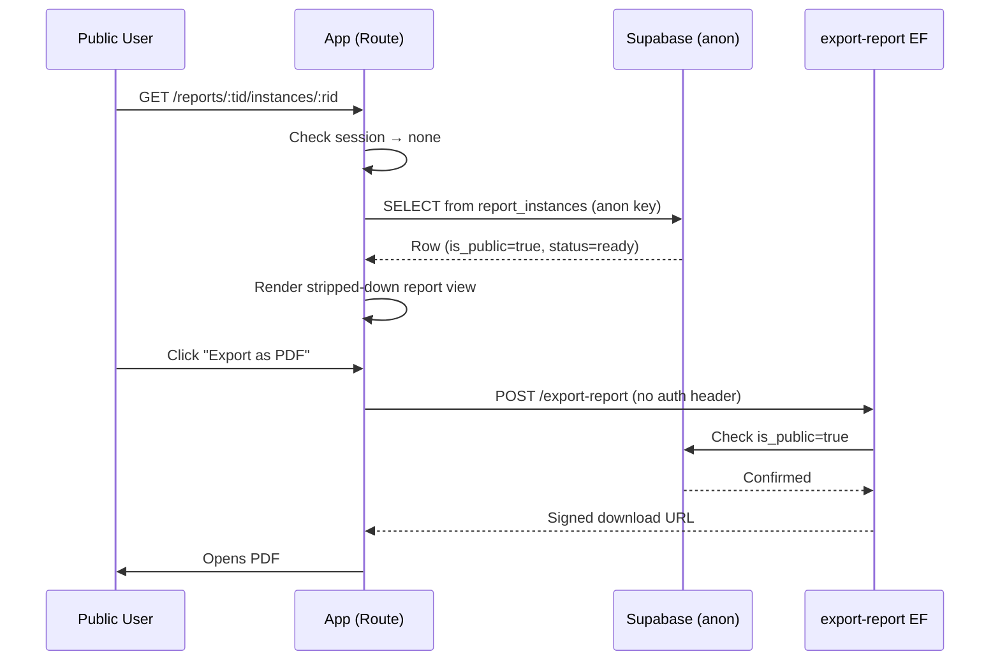

# Public Shareable Report Links — Design

**Date:** 2026-03-12
**Status:** Approved

## Summary

Allow report instances to be viewed by anyone on the internet via a public link. The same URL serves both authenticated users (full UI with sidebar) and unauthenticated visitors (stripped-down view with just the report and export buttons).

## Decisions

| Decision | Choice |
|----------|--------|
| Who can toggle public/private | Root Admin only |
| Default state | Public by default |
| Link expiration | None — stays public until toggled off |
| URL strategy | Same URL for auth and public — soft auth check |
| Template-level toggle | Sets default for new instances; optionally cascades to existing |
| Export for public users | Allow — skip auth check when `is_public = true` |

## Database Changes

### `report_templates` table

Add column:
- `is_public_default BOOLEAN NOT NULL DEFAULT true`

Controls whether newly generated instances inherit `is_public = true`.

### `report_instances` table

Add column:
- `is_public BOOLEAN NOT NULL DEFAULT true`

Set by the `generate-report` Edge Function, copying from the template's `is_public_default`.

### RLS

Add a SELECT policy on `report_instances` for the `anon` role:

```sql
CREATE POLICY report_instances_public_select ON public.report_instances
  FOR SELECT TO anon
  USING (is_public = true AND status = 'ready');
```

The existing authenticated SELECT policy is unchanged.

Add a SELECT policy on `report_template_versions` and `report_template_sections`/`report_template_fields` for `anon` — scoped to versions referenced by a public, ready instance. This is needed so the public viewer can resolve the template name for display.

Alternatively, since `data_snapshot` on the instance contains all the rendered data, the public route may only need `report_instances` access. Evaluate during implementation.

### UPDATE policy for is_public toggle

Add an UPDATE policy on `report_instances` restricted to `root_admin`:

```sql
CREATE POLICY report_instances_toggle_public ON public.report_instances
  FOR UPDATE TO authenticated
  USING (
    is_active_user() = true
    AND get_current_user_role() = 'root_admin'
  )
  WITH CHECK (
    is_active_user() = true
    AND get_current_user_role() = 'root_admin'
  );
```

## Route Changes

### Current state

The report instance viewer lives at:
`/_authenticated/reports/$templateId/instances/$readableId`

Under the `_authenticated` layout, which redirects to `/login` if no session.

### Target state

Move the report instance viewer **outside** `_authenticated` into a layout with soft auth checking. The route path stays the same:
`/reports/$templateId/instances/$readableId`

The layout does a soft auth check:
1. Try to get the session
2. **Authenticated** → render full UI (sidebar, breadcrumbs, copy link, export, public toggle)
3. **Not authenticated** → fetch instance via anon key
   - If `is_public = true` and `status = 'ready'` → render stripped-down view (no sidebar, just header with title + export buttons, and the report document)
   - If not public or not found → show "Report not available" message with a link to login

### Short URL

No changes needed. The existing Shlink short URL already points to this path. One URL works for everyone.

## Edge Function Changes

### `generate-report`

When creating the instance row, copy the template's `is_public_default`:

```sql
is_public: reportTemplate.is_public_default
```

Requires adding `is_public_default` to the template SELECT query.

### `export-report`

Currently requires `Authorization` header. Modify to also allow unauthenticated exports when the instance has `is_public = true`:

1. Check for `Authorization` header
2. If present → validate as today
3. If absent → look up the instance and check `is_public = true`
   - If public → proceed with export (using `supabaseAdmin`)
   - If not public → return 401

## Frontend Changes

### Report instance viewer page

Split into two rendering modes based on auth state:

**Authenticated (root_admin/admin/editor/viewer):**
- Full sidebar layout
- Breadcrumbs
- Header actions: Copy Link, Export dropdown
- Root Admin sees a public/private toggle (Switch component)
- Toggle calls `supabase.from('report_instances').update({ is_public }).eq('id', id)` via client SDK

**Unauthenticated (public):**
- No sidebar, no breadcrumbs
- Minimal header: report title/ID + Export dropdown only
- No toggle, no copy link
- Report document rendered identically

### Report template builder (root_admin only)

Add a "Public by default" toggle (Switch) in the template metadata panel alongside auto-generate.

When toggled off after being on, show a confirmation dialog:
- "Apply to existing instances too?"
- **"New instances only"** — just updates the template default
- **"All instances"** — also runs `UPDATE report_instances SET is_public = false WHERE report_template_version_id IN (SELECT id FROM report_template_versions WHERE report_template_id = $1)`

### Report template detail page

Show a badge on instances indicating public/private status.

## Data Flow



## Security Considerations

- `anon` can only SELECT `report_instances` where `is_public = true AND status = 'ready'`
- `anon` cannot UPDATE, INSERT, or DELETE anything
- Export function validates `is_public` server-side before generating files
- Only `root_admin` can toggle `is_public`
- The `data_snapshot` JSONB column contains the full rendered report — no additional table access is needed for public viewers
