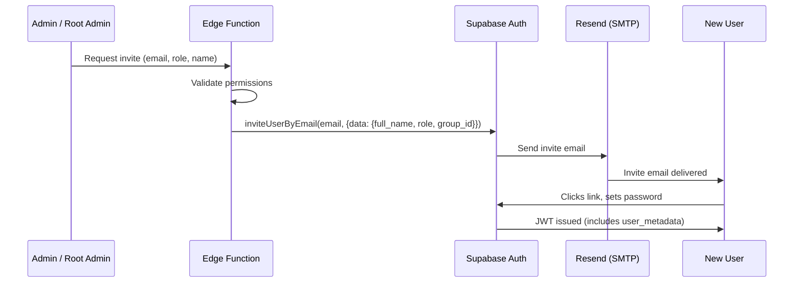
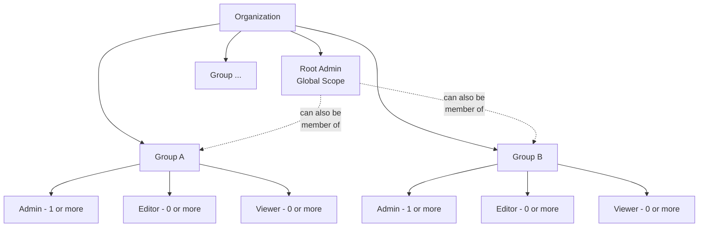
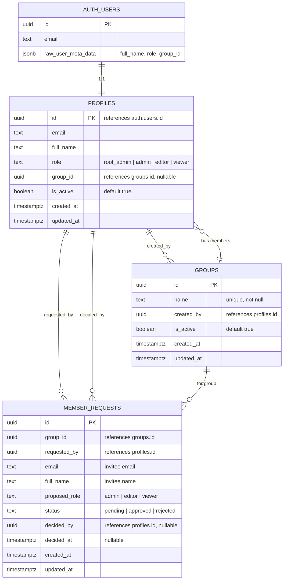
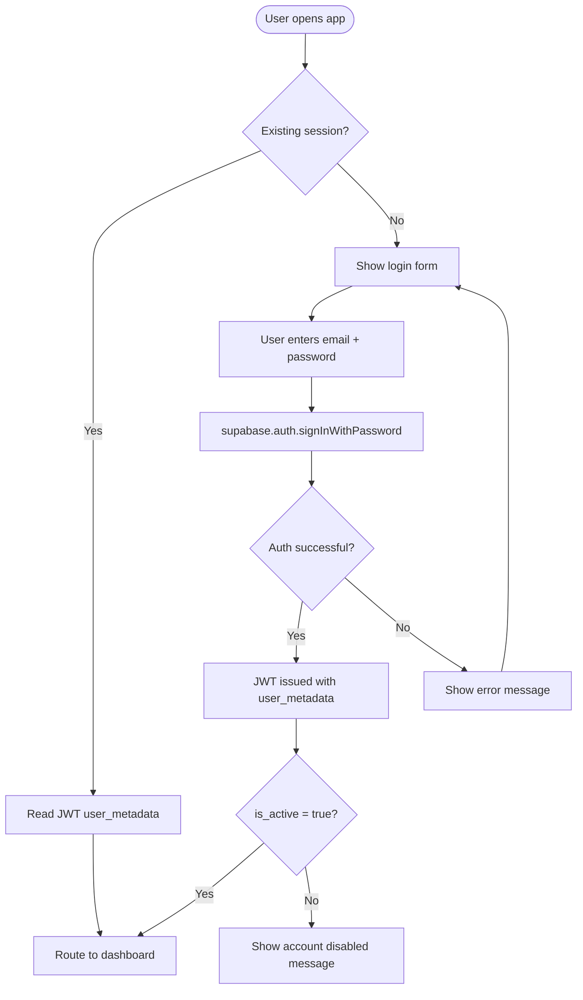
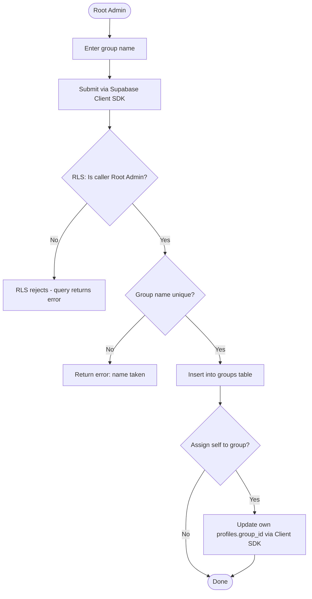
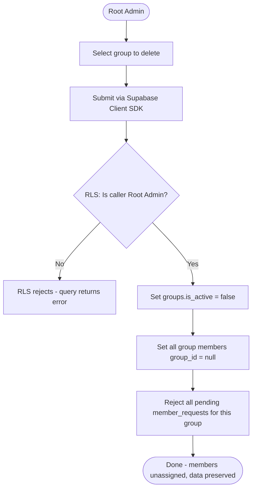
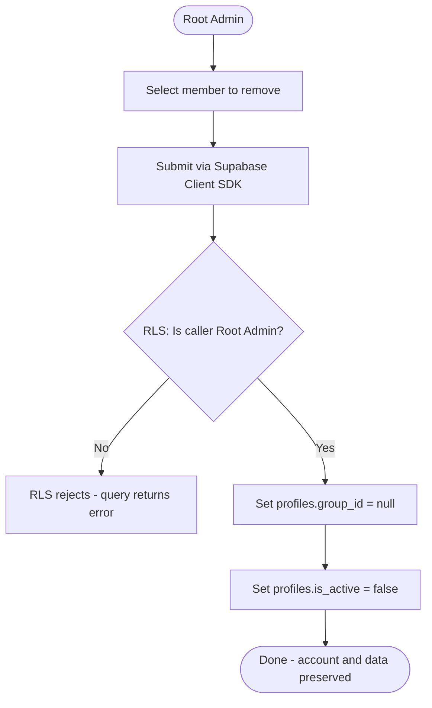
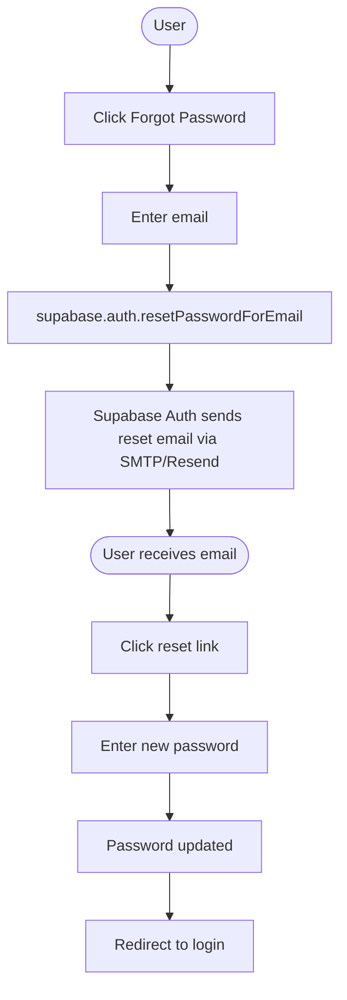
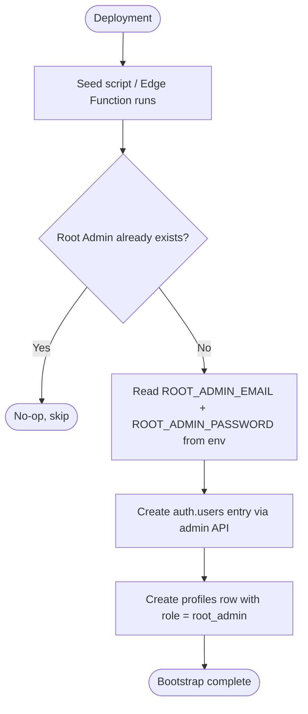

# Auth, RBAC & Groups

[Back to System Design Index](./index.md)

---

## 1. Authentication & User Management

### Overview

Authentication uses Supabase Auth with email/password. The system is invite-only -- no public registration. A single global role is assigned per user at invite time. Role and name are stored in both the `profiles` table (source of truth) and `auth.users.raw_user_meta_data` (convenience cache for JWT access).

All Postgres reads/writes for auth-related tables (`profiles`, `groups`, `member_requests`) go through the Supabase Client SDK with RLS. Edge Functions are only used for operations requiring the service role key (auth admin API calls, custom emails).

### Auth Flow



### User Provisioning

- **Invite-only.** Users cannot self-register.
- An Admin or Root Admin invites users via the app, which calls `supabase.auth.admin.inviteUserByEmail()` through an Edge Function.
- The Edge Function passes `full_name`, `role`, and `group_id` in the `data` option so they are stored in `auth.users.raw_user_meta_data`.
- The Edge Function also inserts a row into the `profiles` table with the assigned role and group.
- The invited user receives an email (sent by Supabase Auth via Resend SMTP), clicks the link, sets their password, and is authenticated.

### Root Admin Bootstrap

- The first Root Admin is created during deployment via environment variables (`ROOT_ADMIN_EMAIL`, `ROOT_ADMIN_PASSWORD`).
- A seed script or Edge Function reads these env vars and creates the user + `profiles` row if no Root Admin exists.
- The endpoint is idempotent -- it no-ops if a Root Admin already exists.
- After bootstrap, the env vars can be removed. All subsequent users are invited through the app.

### Session Management

- Supabase Auth defaults: short-lived access token (~1hr), auto-rotating refresh token.
- No custom session timeout. Users stay logged in until explicit sign-out or prolonged inactivity.
- Frontend reads the JWT `user_metadata` to determine role/name for UI rendering.
- Authorization is never trusted from the frontend -- always enforced server-side.

### Password Recovery

- Standard email-based reset via `supabase.auth.resetPasswordForEmail()`.
- Supabase Auth sends the reset email automatically via Resend SMTP.

### Email Delivery Strategy

| Scenario | Mechanism |
|---|---|
| Invite emails | Supabase Auth (`inviteUserByEmail()`) via SMTP (Resend) |
| Password reset emails | Supabase Auth (`resetPasswordForEmail()`) via SMTP (Resend) |
| Custom/manual emails (notifications, approvals, rejections) | Resend TS SDK called from Edge Functions |

### Authorization Enforcement Layers

| Layer | Mechanism | Purpose |
|---|---|---|
| **Frontend** | Read role from JWT `user_metadata` | UI gating (show/hide features). Never trusted for security. |
| **Database (RLS)** | Policies referencing `profiles.role` and `profiles.group_id` | **Primary authorization layer.** Enforces all access control for Postgres reads and writes via the Client SDK. |
| **Edge Functions** | Validate JWT + check `profiles.role` | Only for operations requiring the service role key (auth admin API, custom emails). Not used for general data access. |

### Security Considerations

- Invite Edge Function is restricted to `admin` and `root_admin` roles.
- Root Admin creation endpoint is idempotent.
- `is_active = false` users are rejected at the Edge Function layer even if their JWT is still valid.
- No role escalation: only Root Admin can assign `admin` or `root_admin` roles.
- If a role changes in `profiles`, `auth.users.raw_user_meta_data` must be updated in the same operation via `supabase.auth.admin.updateUserById()`.

---

## 2. Users, Roles & Groups

### Overview

The platform is single-tenant -- one organization with multiple groups. Each user belongs to exactly one group and holds a single role. The Root Admin has global authority and can also be a member of specific groups.

### Organizational Hierarchy



### Role Definitions

| Role | Scope | Key Permissions |
|---|---|---|
| **Root Admin** | Global + member of specific groups | Create/delete groups, approve/reject member requests, manage all users, full data visibility |
| **Admin** | Group-scoped | Manage group forms, request new members (with proposed role), assign fields to editors |
| **Editor** | Group-scoped | Fill assigned fields in form instances |
| **Viewer** | Group-scoped | Read-only access to completed forms and reports |

### Constraints & Rules

- Only Root Admin can create or delete groups.
- Only Root Admin can approve/reject member requests.
- Only Root Admin can remove members from groups.
- Admins can only request members for their own group.
- Admins cannot request `root_admin` role for new members.
- A user with `group_id = null` cannot perform any group-scoped actions until reassigned.
- Root Admin's `group_id` can be set (they belong to a group) but their permissions are global regardless.
- Group deletion is soft-delete (`is_active = false`). Members become unassigned, accounts and data are preserved.
- Member removal sets `group_id = null` and `is_active = false`. Account and historical data are preserved.

---

## 3. Database Schema

### Entity Relationship Diagram



### Table Details

#### `profiles`

| Column | Type | Constraints | Description |
|---|---|---|---|
| `id` | UUID | PK, FK -> `auth.users.id` | Matches Supabase Auth user ID |
| `email` | TEXT | NOT NULL | Denormalized from auth.users for convenience |
| `full_name` | TEXT | NOT NULL | User's display name |
| `role` | TEXT | NOT NULL, CHECK | One of: `root_admin`, `admin`, `editor`, `viewer` |
| `group_id` | UUID | FK -> `groups.id`, NULLABLE | NULL if unassigned |
| `is_active` | BOOLEAN | NOT NULL, DEFAULT true | Soft-disable without deleting |
| `created_at` | TIMESTAMPTZ | NOT NULL, DEFAULT now() | |
| `updated_at` | TIMESTAMPTZ | NOT NULL, DEFAULT now() | |

#### `groups`

| Column | Type | Constraints | Description |
|---|---|---|---|
| `id` | UUID | PK, DEFAULT gen_random_uuid() | |
| `name` | TEXT | NOT NULL, UNIQUE | Group display name |
| `created_by` | UUID | NOT NULL, FK -> `profiles.id` | Root Admin who created it |
| `is_active` | BOOLEAN | NOT NULL, DEFAULT true | Soft-delete flag |
| `created_at` | TIMESTAMPTZ | NOT NULL, DEFAULT now() | |
| `updated_at` | TIMESTAMPTZ | NOT NULL, DEFAULT now() | |

#### `member_requests`

| Column | Type | Constraints | Description |
|---|---|---|---|
| `id` | UUID | PK, DEFAULT gen_random_uuid() | |
| `group_id` | UUID | NOT NULL, FK -> `groups.id` | Target group |
| `requested_by` | UUID | NOT NULL, FK -> `profiles.id` | Admin who made the request |
| `email` | TEXT | NOT NULL | Invitee's email address |
| `full_name` | TEXT | NOT NULL | Invitee's name |
| `proposed_role` | TEXT | NOT NULL, CHECK | One of: `admin`, `editor`, `viewer` |
| `status` | TEXT | NOT NULL, CHECK, DEFAULT 'pending' | One of: `pending`, `approved`, `rejected` |
| `decided_by` | UUID | FK -> `profiles.id`, NULLABLE | Root Admin who approved/rejected |
| `decided_at` | TIMESTAMPTZ | NULLABLE | When the decision was made |
| `created_at` | TIMESTAMPTZ | NOT NULL, DEFAULT now() | |
| `updated_at` | TIMESTAMPTZ | NOT NULL, DEFAULT now() | |

---

## 4. Activity Diagrams

### 4.1 User Authentication (Login)



### 4.2 User Invite Flow

```mermaid
flowchart TD
    A([Admin / Root Admin]) --> B[Enter invitee email, name, role]
    B --> F{Caller is Admin?}
    F -->|Yes|     G[Insert member_request via Client SDK<br/>RLS: caller must be Admin of this group]
    G --> H[Edge Function sends notification email<br/>to Root Admin via Resend SDK]
    H --> I([Wait for Root Admin decision])
    I --> J{Approved?}
    J -->|No| K[Update status = rejected via Client SDK<br/>RLS: caller must be Root Admin]
    K --> L[Edge Function notifies requesting Admin<br/>via Resend SDK]
    J -->|Yes| M[Update status = approved via Client SDK<br/>RLS: caller must be Root Admin]
    M --> N[Edge Function: inviteUserByEmail with metadata<br/>+ create profiles row]
    N --> P[Supabase Auth sends invite email via SMTP/Resend]
    P --> Q([Invitee receives email])
    F -->|No, Root Admin| R[Edge Function: inviteUserByEmail<br/>with metadata directly]
    R --> S[Create profiles row]
    S --> P
```

### 4.3 Group Creation



### 4.4 Group Deletion



### 4.5 Member Removal



### 4.6 Password Recovery



### 4.7 Root Admin Bootstrap


