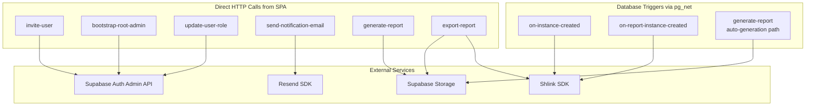

# Edge Function Inventory

[Back to System Design Index](./index.md)

---

## 1. Overview

Edge Functions are a thin server-side layer reserved for operations that require the service role key or external service access. They are **not** a general-purpose API. All standard Postgres reads/writes go through the Supabase Client SDK with RLS.

Edge Functions are invoked in two ways:
1. **Direct HTTP call** from the SPA (for auth admin operations, report generation, report export)
2. **Database trigger via pg_net** (for post-creation tasks like short URL generation, and auto-report generation)

---

## 2. Function Inventory

### 2.1 `invite-user`

| Property | Value |
|---|---|
| **Trigger** | Direct HTTP call from SPA |
| **Auth** | JWT required. Caller must be `admin` or `root_admin`. |
| **Purpose** | Invite a new user to the platform. Creates auth user + profiles row. |

**Input:**
```json
{
  "email": "user@example.com",
  "full_name": "Jane Doe",
  "role": "editor",
  "group_id": "uuid"
}
```

**Logic:**
1. Validate caller's JWT and role from `profiles`.
2. If caller is Admin: verify the request came through an approved `member_requests` row (`status = 'approved'`).
3. If caller is Root Admin: proceed directly.
4. Call `supabase.auth.admin.inviteUserByEmail()` with `data: { full_name, role, group_id, is_active: true }`.
5. Insert row into `profiles` table with role and group.
6. Return success.

**Output:**
```json
{
  "success": true,
  "user_id": "uuid"
}
```

**Error cases:** 403 if unauthorized, 409 if email already exists, 400 if invalid role.

---

### 2.2 `bootstrap-root-admin`

| Property | Value |
|---|---|
| **Trigger** | Direct HTTP call (deployment script or one-time manual call) |
| **Auth** | Uses env vars `ROOT_ADMIN_EMAIL` and `ROOT_ADMIN_PASSWORD`. No JWT required. Idempotent. |
| **Purpose** | Create the first Root Admin account during initial deployment. |

**Logic:**
1. Read `ROOT_ADMIN_EMAIL` and `ROOT_ADMIN_PASSWORD` from environment.
2. Check if any `profiles` row with `role = 'root_admin'` exists.
3. If yes: return no-op.
4. If no: create auth user via `supabase.auth.admin.createUser()` with metadata.
5. Insert `profiles` row with `role = 'root_admin'`.

**Output:**
```json
{
  "created": true | false,
  "message": "Root admin created" | "Root admin already exists"
}
```

---

### 2.3 `update-user-role`

| Property | Value |
|---|---|
| **Trigger** | Direct HTTP call from SPA |
| **Auth** | JWT required. Caller must be `root_admin`. |
| **Purpose** | Sync role/group/active status changes to `auth.users.raw_user_meta_data` after a `profiles` update. |

**Input:**
```json
{
  "user_id": "uuid",
  "role": "admin",
  "group_id": "uuid",
  "is_active": true
}
```

**Logic:**
1. Validate caller is Root Admin.
2. Call `supabase.auth.admin.updateUserById(user_id, { data: { role, group_id, is_active } })`.
3. Return success.

**Output:**
```json
{
  "success": true
}
```

**Notes:** This must be called whenever the `profiles` table is updated for role, group_id, or is_active. Keeps JWT metadata in sync with the source of truth.

---

### 2.4 `send-notification-email`

| Property | Value |
|---|---|
| **Trigger** | Direct HTTP call from SPA or from other Edge Functions |
| **Auth** | JWT required. Caller must be `admin` or `root_admin`. |
| **Purpose** | Send custom notification emails via Resend SDK. |

**Input:**
```json
{
  "to": "user@example.com",
  "template": "member_request_pending" | "member_request_approved" | "member_request_rejected",
  "data": {
    "requester_name": "John Doe",
    "group_name": "Main Service",
    "proposed_role": "editor"
  }
}
```

**Logic:**
1. Validate caller's JWT and role.
2. Select email template and render with provided data.
3. Send via Resend SDK.
4. Return success.

**Output:**
```json
{
  "success": true,
  "message_id": "resend-message-id"
}
```

---

### 2.5 `on-instance-created`

| Property | Value |
|---|---|
| **Trigger** | Database trigger via pg_net (AFTER INSERT on `form_instances`) |
| **Auth** | Called with service role key by pg_net. No user JWT. |
| **Purpose** | Generate short URLs for a newly created form instance. |

**Input (from pg_net payload):**
```json
{
  "record": {
    "id": "uuid",
    "readable_id": "epr-001"
  }
}
```

**Logic:**
1. Call Shlink SDK to create short URL for view: `/{readable_id}/view`.
2. Call Shlink SDK to create short URL for edit: `/{readable_id}/edit`.
3. Update `form_instances` row with `short_url_view` and `short_url_edit`.

**Output:** None (fire-and-forget from trigger perspective). Errors logged.

---

### 2.6 `on-report-instance-created`

| Property | Value |
|---|---|
| **Trigger** | Database trigger via pg_net (AFTER INSERT on `report_instances`) |
| **Auth** | Called with service role key by pg_net. No user JWT. |
| **Purpose** | Generate short URL for a newly created report instance. |

**Input (from pg_net payload):**
```json
{
  "record": {
    "id": "uuid",
    "readable_id": "epr-r-001"
  }
}
```

**Logic:**
1. Call Shlink SDK to create short URL: `/report/{readable_id}`.
2. Update `report_instances` row with `short_url`.

**Output:** None (fire-and-forget). Errors logged.

---

### 2.7 `generate-report`

| Property | Value |
|---|---|
| **Trigger** | Direct HTTP call from SPA (manual creation) OR database trigger via pg_net (auto-generation on form submission) |
| **Auth** | When called from SPA: JWT required, caller must be `root_admin`. When called from pg_net: service role key. |
| **Purpose** | Compute report data from form instances and create an immutable report instance. |

**Input:**
```json
{
  "report_template_id": "uuid",
  "form_instance_ids": ["uuid", "uuid"],
  "auto_generated": false
}
```

For auto-generation (from pg_net trigger), form instance IDs are determined by the trigger logic (all instances in the schedule batch or the single one-time instance).

**Logic:**
1. Fetch the latest `report_template_version` with sections and fields.
2. Fetch `field_values` for all specified `form_instance_ids`.
3. Resolve each report field:
   - **Formula**: Parse expression, compute aggregates (SUM, AVERAGE, MIN, MAX, COUNT, MEDIAN) across field values, apply arithmetic.
   - **Dynamic variable**: Look up specific field value.
   - **Table**: Build row data from field values, grouped as configured.
   - **Static text**: Pass through as-is.
4. Build `data_snapshot` JSONB with all resolved values.
5. Increment `report_templates.instance_counter`.
6. Generate `readable_id` from abbreviation + counter.
7. Insert `report_instances` row.
8. (The INSERT triggers `on-report-instance-created` for short URL generation.)

**Output:**
```json
{
  "success": true,
  "report_instance_id": "uuid",
  "readable_id": "epr-r-001"
}
```

**Error cases:** 403 if unauthorized, 400 if no submitted form instances found, 400 if formula computation fails (division by zero, type mismatch).

---

### 2.8 `export-report`

| Property | Value |
|---|---|
| **Trigger** | Direct HTTP call from SPA |
| **Auth** | JWT required. Any authenticated active user. |
| **Purpose** | Generate PDF or Word export of a report instance. Caches result in Supabase Storage. |

**Input:**
```json
{
  "report_instance_id": "uuid",
  "format": "pdf" | "docx"
}
```

**Logic:**
1. Validate caller is authenticated and active.
2. Fetch `report_instances` row.
3. **Cache check**: If `export_pdf_path` (for PDF) or `export_docx_path` (for DOCX) is already set, return the existing download URL immediately.
4. Read `data_snapshot` from the report instance.
5. Generate document:
   - PDF: render using `pdf-lib`
   - Word: render using `docx` library
6. Compress the generated file.
7. Upload to Supabase Storage.
8. Update `report_instances` row with the storage path.
9. Return download URL.

**Output:**
```json
{
  "success": true,
  "download_url": "https://storage.supabase.co/..."
}
```

**Error cases:** 404 if report instance not found, 400 if invalid format.

---

## 3. Database Triggers Inventory

These triggers invoke Edge Functions via `pg_net`:

| Trigger | Table | Event | Edge Function | Purpose |
|---|---|---|---|---|
| `trigger_on_form_instance_created` | `form_instances` | AFTER INSERT | `on-instance-created` | Generate short URLs for new form instance |
| `trigger_on_report_instance_created` | `report_instances` | AFTER INSERT | `on-report-instance-created` | Generate short URL for new report instance |
| `trigger_on_form_instance_submitted` | `form_instances` | AFTER UPDATE (status -> 'submitted') | `generate-report` | Auto-generate report if `auto_generate = true` and completion conditions met |

### `updated_at` Auto-Update Trigger

A generic trigger function applied to all tables with an `updated_at` column:

```sql
CREATE OR REPLACE FUNCTION public.update_updated_at()
RETURNS TRIGGER
LANGUAGE plpgsql
AS $$
BEGIN
  NEW.updated_at = now();
  RETURN NEW;
END;
$$;
```

Applied to: `profiles`, `groups`, `member_requests`, `form_templates`, `form_instances`, `report_templates`, `instance_schedules`.

---

## 4. pg_cron Jobs

| Job | Schedule | Purpose |
|---|---|---|
| `create_scheduled_instances` | Runs every 5 minutes | Queries `instance_schedules` where `next_run_at <= now() AND is_active = true`. Creates form instances for each target group. Updates `last_run_at` and computes `next_run_at`. |

---

## 5. Summary Diagram



---

## 6. Environment Variables

Edge Functions require these environment variables:

| Variable | Used By | Description |
|---|---|---|
| `SUPABASE_SERVICE_ROLE_KEY` | All | Service role key for bypassing RLS |
| `SUPABASE_URL` | All | Supabase project URL |
| `RESEND_API_KEY` | `send-notification-email` | Resend SDK API key |
| `SHLINK_API_KEY` | `on-instance-created`, `on-report-instance-created` | Shlink SDK API key |
| `SHLINK_BASE_URL` | `on-instance-created`, `on-report-instance-created` | Shlink server URL |
| `ROOT_ADMIN_EMAIL` | `bootstrap-root-admin` | Initial Root Admin email |
| `ROOT_ADMIN_PASSWORD` | `bootstrap-root-admin` | Initial Root Admin password |
