# Form System

[Back to System Design Index](./index.md)

---

## 1. Overview

Root Admin creates form templates using a visual form builder. Templates contain sections (each rendered as a page), and sections contain fields. Templates are versioned on edit, shared to all groups by default (restrictable), and support scheduled or one-time instance creation. Admins and Editors fill fields. Only Admins can submit instances. All field changes are audited.

---

## 2. Core Concepts

| Concept | Description |
|---|---|
| **Form Template** | Structure definition: title, description, sections, fields, field types, validation. Created by Root Admin only. Versioned on edit. |
| **Template Version** | Snapshot of template at a point in time. Existing instances stay pinned to their version. New instances use the latest. Restoring a version creates a new version with the old content (full history preserved). |
| **Form Section** | A grouping of fields within a template version. Each section is its own page when viewed/filled. Has a title and description. New templates start with one default section. |
| **Form Instance** | A runtime copy of a template version, owned by a group. Has a human-readable ID: `{abbreviation}-{sequential-number}` (e.g., `epr-001`). |
| **Field Assignment** | Optional lock of a field on an instance to a specific Editor. Unassigned fields are open to all Admins/Editors on the group. Stored directly on the `field_values` row. |
| **Field Change Log** | Append-only audit trail stored as a JSONB array on the `field_values` row: who, when, old value, new value. Visible to all group members. |
| **Instance Schedule** | Automated recurring instance creation for shared groups. One schedule per template. Managed by Root Admin. Executed by pg_cron. |

---

## 3. Template Management

- Only Root Admin can create, edit, delete, and restore templates.
- Templates have a **name**, **description**, and an **abbreviation** (short form of the name, used in instance IDs and short URLs, e.g., "Employee Performance Review" -> `epr`).
- New templates start with one default section (titled "Section 1").
- Editing a published template creates a new version. Existing instances stay on their version.
- **Version restore:** Restoring a previous version creates a new version with the old version's content. Full history is preserved -- nothing is overwritten.
- **Version viewing:** Root Admin can view any previous version of a template.
- Deleting a template is a **soft-delete** (template marked inactive). All existing instances are **archived** (read-only, moved to an archive view).

---

## 4. Form Sections

- A section has a **title**, **description**, and **sort_order**.
- Each section renders as its own page when filling or viewing a form instance.
- Fields belong to a section.
- Sections are defined per template version (versioned with the template).
- When a new template is created, it has one default section.

---

## 5. Field Types

| Field Type | Storage | Notes |
|---|---|---|
| `text` | TEXT | Single-line text input |
| `textarea` | TEXT | Multi-line text input |
| `number` | NUMERIC | Numeric input with optional min/max |
| `date` | DATE | Date picker |
| `select` | TEXT | Single-select dropdown (UI label: "Choice") |
| `multi_select` | JSONB | Multi-select, stored as array (UI label: "Choice" with multi toggle) |
| `checkbox` | BOOLEAN | Single checkbox |
| `rating` | INTEGER | Star/number rating. Configurable max (e.g., 5 or 10) via `validation_rules` |
| `range` | NUMERIC | Numeric range slider. Min/max/step configured via `validation_rules` |
| `file` | TEXT (storage path) | File upload via Supabase Storage. Compressed before upload (see [Storage Policy](./index.md#storage-policy)). |

---

## 6. Form Instance Lifecycle

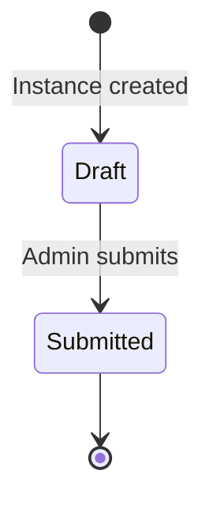

- **Draft**: Admins and Editors fill fields. Changes are saved and tracked in the change log.
- **Submitted**: Instance is locked. No further edits. Visible to Viewers. Only an **Admin** of the owning group can submit.

---

## 7. Human-Readable Instance IDs & Short URLs

### Instance ID Format

Each form instance gets a human-readable ID combining the template abbreviation and a sequential number:

- Format: `{abbreviation}-{NNN}` (e.g., `epr-001`, `sc-042`)
- The abbreviation is derived from the template name (e.g., "Employee Performance Review" -> `epr`, "Safety Checklist" -> `sc`).
- Sequential counter is per-template, stored on `form_templates.instance_counter`.

### Short URLs

Short URLs are generated via **Shlink JS SDK** called from an **Edge Function** (keeps API key server-side):

- View: `https://short.domain/f/epr-001-view` -> `https://app.domain/forms/epr-001?mode=view`
- Edit: `https://short.domain/f/epr-001-edit` -> `https://app.domain/forms/epr-001?mode=edit`

Shlink slugs use the `f/` prefix to namespace form short URLs (reports will use `r/`). The `-view`/`-edit` suffix is flat (no nested paths). The app route uses `?mode=view|edit` query param -- a single route component handles both modes. Short URLs are stored on the `form_instances` row.

---

## 8. Field Assignment

- All fields are **open by default** -- any Admin or Editor on the owning group can fill them.
- An Admin can optionally **assign** a field to a specific Editor, locking that field so only the assigned Editor can edit it.
- Assignment is stored directly on the `field_values` row (`assigned_to` and `assigned_by` columns). When both are null, the field is open.
- Admins can reassign or unassign fields at any time while the instance is in draft.

### Field Values: Lazy Creation

- `field_values` rows are **not pre-created** when a form instance is created. They are created on first interaction:
  - **On first edit**: When a user fills a field for the first time, the `field_values` row is inserted with the value, `updated_by` set to the editing user, and the first `change_log` entry.
  - **On assignment**: When an Admin assigns a field before anyone edits it, the `field_values` row is created with `value = null`, `updated_by = assigned_by` (the Admin), `assigned_to` set, and an empty `change_log`.
- When rendering a form, if no `field_values` row exists for a template field, it is treated as **empty and open to all** Admins/Editors on the group.

---

## 9. Audit Trail (Field Change Log)

Every field value change is logged in a JSONB array (`change_log`) on the `field_values` row. Each entry:

```json
{
  "old_value": "previous value or null",
  "new_value": "new value",
  "changed_by": "user-uuid",
  "changed_at": "2026-03-05T10:30:00Z"
}
```

- The array is **append-only** in practice. New entries are added to the end.
- Visible to all group members on the form instance.
- First entry has `old_value: null`.
- Eliminates the need for a separate `field_change_log` table and avoids joins when viewing a field's history.

---

## 10. Instance Creation & Scheduling

### One-Time Instance

- Root Admin creates a one-time instance for a specific group (or all shared groups).
- Can be done during template creation or later from the template management screen.
- Instance is created immediately.
- Root Admin can create additional one-time instances at any time, even if a schedule exists.

### Scheduled Instances

- Root Admin sets up a schedule for a template: start date, repeat interval, and which groups receive instances.
- **One schedule per template.** Cannot create a second schedule, but can edit the existing one.
- Supported intervals: `daily`, `weekly` (with specific days of week), `bi_weekly`, `monthly`.
- "Repeat every N" multiplier (e.g., every 2 weeks, every 3 months).
- A **pg_cron** job runs periodically, checks `instance_schedules.next_run_at`, and creates instances automatically for all target groups.
- Groups can be added to an existing schedule later.
- Root Admin can edit schedule settings (interval, groups, dates) but cannot create a second schedule for the same template.
- Root Admin can still create one-time instances for a template that has a schedule.

### Database Trigger: `on_form_instance_created`

A PostgreSQL trigger on the `form_instances` table fires **after every INSERT**. This trigger invokes an Edge Function (`on-instance-created`) via `pg_net` (Supabase's HTTP extension) to handle post-creation tasks:

1. Generate short URLs via Shlink JS SDK (view + edit).
2. Store the short URLs back on the `form_instances` row.
3. Any future post-creation logic (e.g., notifications) is added here.

This single trigger handles all instance creation sources uniformly -- one-time instances created via Client SDK and scheduled instances created by pg_cron both go through the same path.

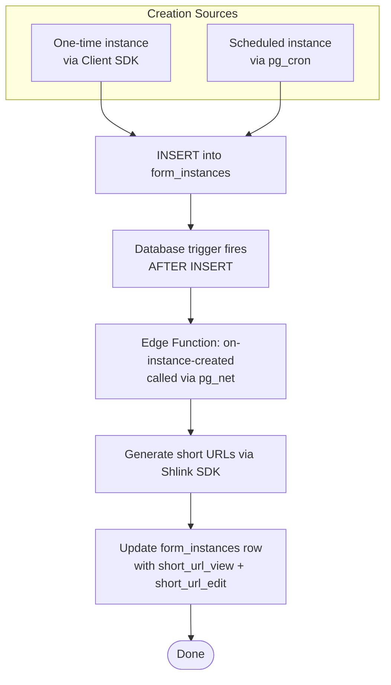

### Scheduling Flow

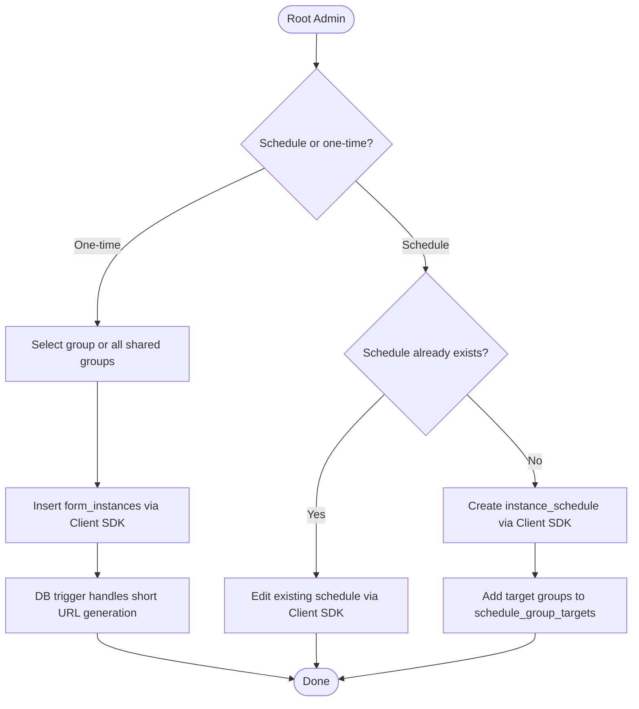

### pg_cron Execution Flow

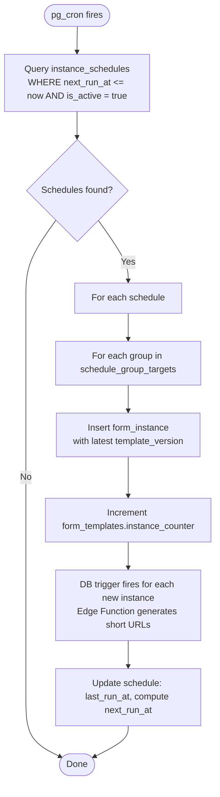

---

## 11. Template Sharing & Access Control

- Templates are shared to **all groups by default** (`sharing_mode = 'all'`).
- Root Admin can restrict to specific groups (`sharing_mode = 'restricted'` + `template_group_access` rows).
- If access is revoked from a group, their existing instances are **archived** (read-only) but they cannot create new instances.

---

## 12. Database Schema

### Entity Relationship Diagram

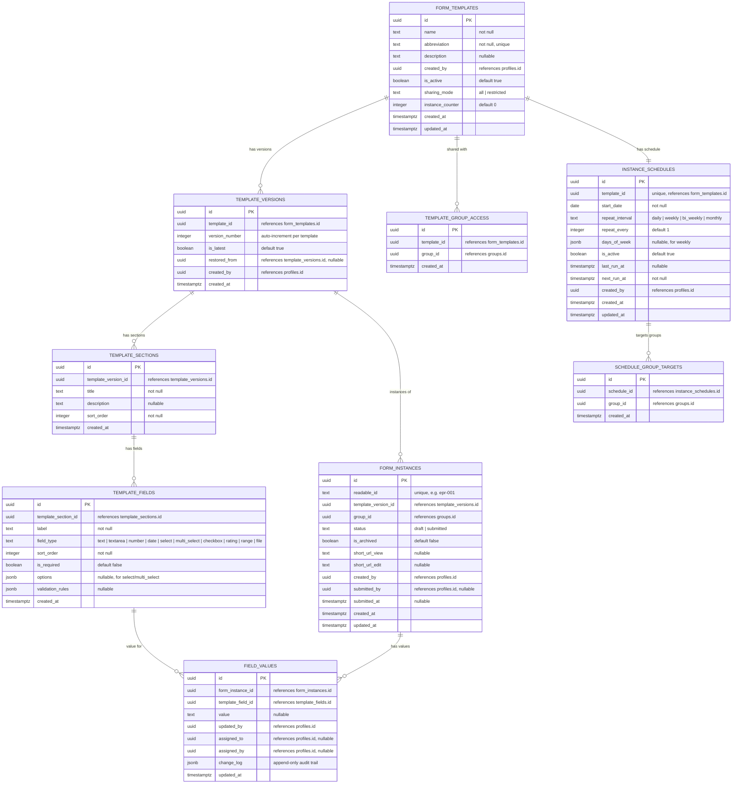

### Table Details

#### `form_templates`

| Column | Type | Constraints | Description |
|---|---|---|---|
| `id` | UUID | PK | |
| `name` | TEXT | NOT NULL | Display name |
| `abbreviation` | TEXT | NOT NULL, UNIQUE | Short form for IDs/URLs (e.g., `epr`) |
| `description` | TEXT | NULLABLE | |
| `created_by` | UUID | NOT NULL, FK -> `profiles.id` | Root Admin |
| `is_active` | BOOLEAN | NOT NULL, DEFAULT true | Soft-delete |
| `sharing_mode` | TEXT | NOT NULL, DEFAULT 'all' | `all` or `restricted` |
| `instance_counter` | INTEGER | NOT NULL, DEFAULT 0 | Sequential counter for instance IDs |
| `created_at` | TIMESTAMPTZ | NOT NULL, DEFAULT now() | |
| `updated_at` | TIMESTAMPTZ | NOT NULL, DEFAULT now() | |

#### `template_versions`

| Column | Type | Constraints | Description |
|---|---|---|---|
| `id` | UUID | PK | |
| `template_id` | UUID | NOT NULL, FK -> `form_templates.id` | |
| `version_number` | INTEGER | NOT NULL | Auto-incrementing per template |
| `is_latest` | BOOLEAN | NOT NULL, DEFAULT true | Only one version per template is latest |
| `restored_from` | UUID | NULLABLE, FK -> `template_versions.id` | If restored from another version |
| `created_by` | UUID | NOT NULL, FK -> `profiles.id` | |
| `created_at` | TIMESTAMPTZ | NOT NULL, DEFAULT now() | |

Unique constraint on (`template_id`, `version_number`).

#### `template_sections`

| Column | Type | Constraints | Description |
|---|---|---|---|
| `id` | UUID | PK | |
| `template_version_id` | UUID | NOT NULL, FK -> `template_versions.id` | |
| `title` | TEXT | NOT NULL | Section title |
| `description` | TEXT | NULLABLE | Section description |
| `sort_order` | INTEGER | NOT NULL | Position in the form |
| `created_at` | TIMESTAMPTZ | NOT NULL, DEFAULT now() | |

#### `template_fields`

| Column | Type | Constraints | Description |
|---|---|---|---|
| `id` | UUID | PK | |
| `template_section_id` | UUID | NOT NULL, FK -> `template_sections.id` | Which section |
| `label` | TEXT | NOT NULL | Field display label |
| `field_type` | TEXT | NOT NULL, CHECK | `text`, `textarea`, `number`, `date`, `select`, `multi_select`, `checkbox`, `rating`, `range`, `file` |
| `sort_order` | INTEGER | NOT NULL | Position within the section |
| `is_required` | BOOLEAN | NOT NULL, DEFAULT false | |
| `options` | JSONB | NULLABLE | For `select` / `multi_select` |
| `validation_rules` | JSONB | NULLABLE | min, max, pattern, etc. |
| `created_at` | TIMESTAMPTZ | NOT NULL, DEFAULT now() | |

#### `template_group_access`

| Column | Type | Constraints | Description |
|---|---|---|---|
| `id` | UUID | PK | |
| `template_id` | UUID | NOT NULL, FK -> `form_templates.id` | |
| `group_id` | UUID | NOT NULL, FK -> `groups.id` | |
| `created_at` | TIMESTAMPTZ | NOT NULL, DEFAULT now() | |

Unique constraint on (`template_id`, `group_id`).

#### `form_instances`

| Column | Type | Constraints | Description |
|---|---|---|---|
| `id` | UUID | PK | Internal ID |
| `readable_id` | TEXT | NOT NULL, UNIQUE | e.g., `epr-001` |
| `template_version_id` | UUID | NOT NULL, FK -> `template_versions.id` | Pinned version |
| `group_id` | UUID | NOT NULL, FK -> `groups.id` | Owning group |
| `status` | TEXT | NOT NULL, CHECK, DEFAULT 'draft' | `draft` or `submitted` |
| `is_archived` | BOOLEAN | NOT NULL, DEFAULT false | True if template deleted or access revoked |
| `short_url_view` | TEXT | NULLABLE | Shlink short URL for view |
| `short_url_edit` | TEXT | NULLABLE | Shlink short URL for edit |
| `created_by` | UUID | NOT NULL, FK -> `profiles.id` | |
| `submitted_by` | UUID | NULLABLE, FK -> `profiles.id` | Admin who submitted |
| `submitted_at` | TIMESTAMPTZ | NULLABLE | |
| `created_at` | TIMESTAMPTZ | NOT NULL, DEFAULT now() | |
| `updated_at` | TIMESTAMPTZ | NOT NULL, DEFAULT now() | |

#### `field_values`

| Column | Type | Constraints | Description |
|---|---|---|---|
| `id` | UUID | PK | |
| `form_instance_id` | UUID | NOT NULL, FK -> `form_instances.id` | |
| `template_field_id` | UUID | NOT NULL, FK -> `template_fields.id` | |
| `value` | TEXT | NULLABLE | Current field value |
| `updated_by` | UUID | NOT NULL, FK -> `profiles.id` | Last editor |
| `assigned_to` | UUID | NULLABLE, FK -> `profiles.id` | Assigned Editor (null = open to all) |
| `assigned_by` | UUID | NULLABLE, FK -> `profiles.id` | Admin who assigned (null = unassigned) |
| `change_log` | JSONB | NOT NULL, DEFAULT '[]' | Append-only array of `{old_value, new_value, changed_by, changed_at}` |
| `updated_at` | TIMESTAMPTZ | NOT NULL, DEFAULT now() | |

Unique constraint on (`form_instance_id`, `template_field_id`).

#### `instance_schedules`

| Column | Type | Constraints | Description |
|---|---|---|---|
| `id` | UUID | PK | |
| `template_id` | UUID | NOT NULL, UNIQUE, FK -> `form_templates.id` | One schedule per template |
| `start_date` | DATE | NOT NULL | When the schedule begins |
| `repeat_interval` | TEXT | NOT NULL, CHECK | `daily`, `weekly`, `bi_weekly`, `monthly` |
| `repeat_every` | INTEGER | NOT NULL, DEFAULT 1 | Multiplier |
| `days_of_week` | JSONB | NULLABLE | For weekly: array of day numbers (0=Sun, 6=Sat) |
| `is_active` | BOOLEAN | NOT NULL, DEFAULT true | |
| `last_run_at` | TIMESTAMPTZ | NULLABLE | |
| `next_run_at` | TIMESTAMPTZ | NOT NULL | Precomputed next execution |
| `created_by` | UUID | NOT NULL, FK -> `profiles.id` | Root Admin |
| `created_at` | TIMESTAMPTZ | NOT NULL, DEFAULT now() | |
| `updated_at` | TIMESTAMPTZ | NOT NULL, DEFAULT now() | |

#### `schedule_group_targets`

| Column | Type | Constraints | Description |
|---|---|---|---|
| `id` | UUID | PK | |
| `schedule_id` | UUID | NOT NULL, FK -> `instance_schedules.id` | |
| `group_id` | UUID | NOT NULL, FK -> `groups.id` | |
| `created_at` | TIMESTAMPTZ | NOT NULL, DEFAULT now() | |

Unique constraint on (`schedule_id`, `group_id`).

---

## 13. Activity Diagrams

### 13.1 Template Creation

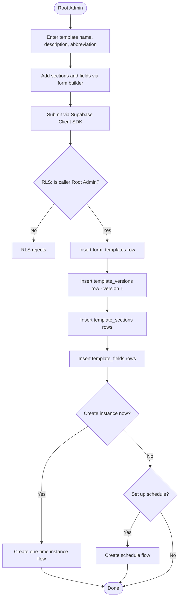

### 13.2 Template Edit (New Version)

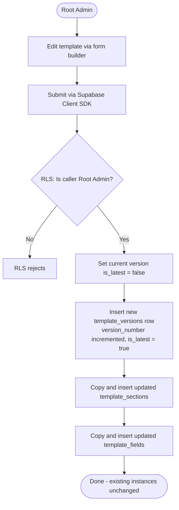

### 13.3 Template Version Restore

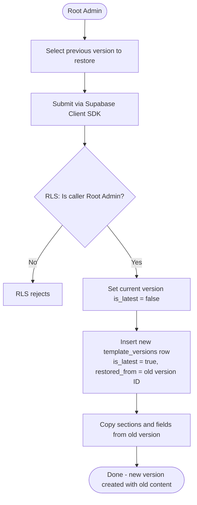

### 13.4 Form Instance Filling

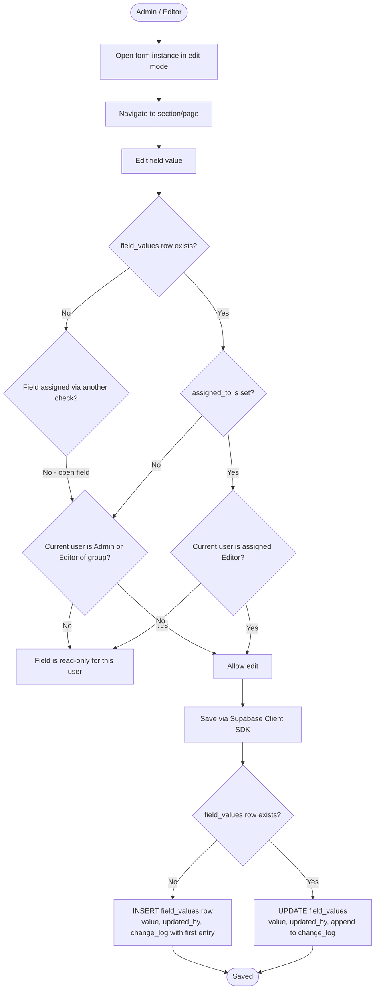

### 13.5 Form Instance Submission

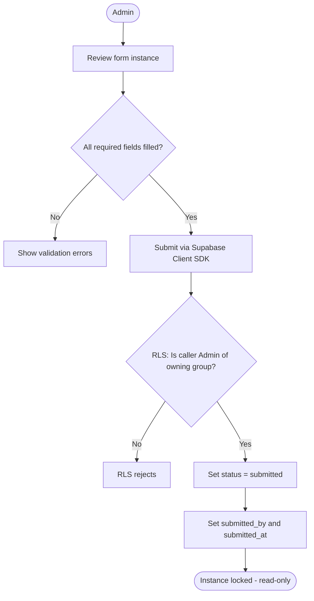

### 13.6 Template Deletion

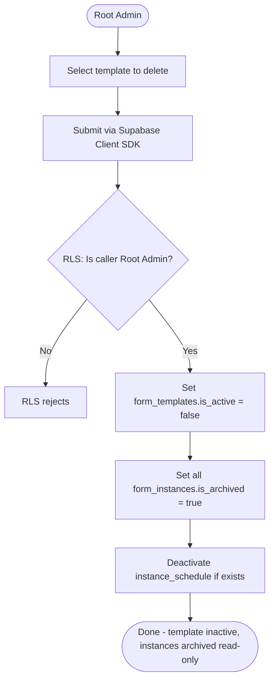

---

## 14. Access Rules Summary

| Action | Who |
|---|---|
| Create/edit/delete/restore template | Root Admin only |
| View template versions | Root Admin only |
| Restrict template to groups | Root Admin only |
| Create one-time instance | Root Admin |
| Create/edit schedule | Root Admin |
| Fill unassigned fields (draft) | Admin or Editor of owning group |
| Fill assigned fields (draft) | Only the assigned Editor |
| Assign/reassign/unassign fields | Admin of owning group |
| Submit form instance | Admin of owning group |
| View submitted form | Admin, Editor, or Viewer of owning group |
| View field change log | Any member of owning group |
