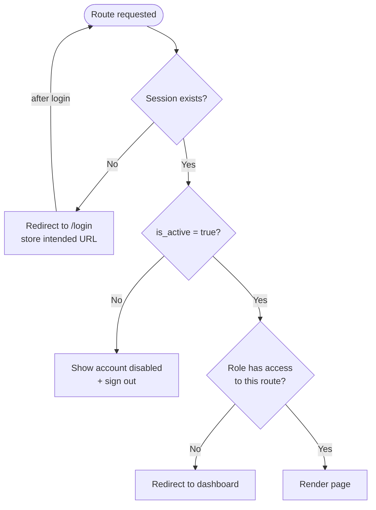

# Frontend Architecture

[Back to System Design Index](./index.md)

---

## 1. Overview

Single-page application using React 19, TanStack Router, Shadcn UI, and TailwindCSS. Sidebar layout for all authenticated pages. Single adaptive dashboard that changes content based on user role. Protected routes redirect unauthenticated users to login.

---

## 2. Technology

| Library | Purpose |
|---|---|
| React 19 | UI rendering |
| TanStack Router | Type-safe file-based routing, data loading |
| TanStack Query | Server state management, caching, background refresh |
| Shadcn UI | Component library (built on Radix UI primitives) |
| TailwindCSS | Utility-first styling |
| Supabase Client SDK | Auth, database reads/writes, storage |

---

## 3. Layout Structure

All authenticated pages share a sidebar layout. Public pages (login, password reset, invite acceptance) use a minimal centered layout.

```mermaid
graph LR
    subgraph Sidebar
        LOGO[Org Logo / Name]
        NAV[Navigation Links<br/>role-filtered]
        USER[User Info<br/>Sign Out]
    end

    subgraph Main Content
        HEADER[Page Header<br/>breadcrumb + actions]
        CONTENT[Route Outlet<br/>page content]
    end

    Sidebar --- Main Content
```

### Sidebar Navigation

The sidebar displays navigation links filtered by the current user's role:

| Nav Item | Root Admin | Admin | Editor | Viewer |
|---|---|---|---|---|
| Home (Dashboard) | Yes | Yes | Yes | Yes |
| Forms | Yes | Yes | Yes | Yes |
| Reports | Yes | Yes | Yes | Yes |
| Groups | Yes | Yes (own) | Yes (own) | Yes (own) |
| Settings | Yes | Yes | Yes | Yes |

Notes:
- The Forms nav item includes a `+` button for Root Admin to create new templates.
- Schedules and Member Requests are accessed from within their parent pages (Forms and Groups respectively), not as top-level nav items.

---

## 4. UI Patterns

### Side Sheet / Drawer

Secondary views that show tables or lists (version history, sharing settings, access control, field assignment management) open as a **side sheet** (drawer panel) that overlays from the right side of the screen. These are not full-page routes.

Used for:
- Form template version history (View / Restore actions)
- Template sharing settings (manage which groups have access)
- Field assignment management on form instances
- Member request management within a group

The side sheet pattern uses Shadcn UI's `Sheet` component.

### Data Tables

List pages (forms, reports, groups, instances) use a consistent data table pattern:
- Stats bar at top (summary counts)
- Search bar + Filters button
- Action button(s) top-right (e.g., "+ New Form")
- Sortable columns with checkboxes for row selection
- Offset-based pagination at bottom ("Showing 1-15 of N", page numbers)

### Page Detail Pattern

Detail pages (form template detail, group detail) follow a consistent structure:
- Stats bar (instance counts, group counts, etc.)
- Action buttons (Versions, Edit, Share, Create Instance, etc.)
- Child data table (instances, members, etc.) with pagination

---

## 5. Route Inventory

### Public Routes (no auth required)

```
/login                              Login page (email + password)
/forgot-password                    Password reset request
/reset-password                     Set new password (from email link)
/invite/accept                      Accept invite + set password
```

### Authenticated Routes (sidebar layout)

```
/                                   Dashboard (adaptive per role)

/forms                              Form template list
/forms/new                          Create form template (Root Admin) - form builder
/forms/:templateId                  Template detail (instances table, stats, actions)
/forms/:templateId/edit             Edit template (Root Admin, creates new version)
/forms/:readableId?mode=edit         Fill form instance (Admin/Editor)
/forms/:readableId?mode=view         View form instance (all group members)

/reports                            Report instance list
/reports/templates                  Report template list (Root Admin)
/reports/templates/new              Create report template (Root Admin)
/reports/templates/:id              Report template detail + versions
/reports/templates/:id/edit         Edit report template (Root Admin)
/reports/:readableId                View report instance (any authenticated user)

/groups                             Group list
/groups/:groupId                    Group detail (members, activity)

/settings                           User settings (change name, password)
```

### Side Sheet Actions (not routes, UI overlays)

```
Form template version history       Opened from "Versions" button on template detail
Template sharing settings            Opened from "Share" button on template detail
Field assignments                    Opened from form instance fill/view
Member requests                      Opened from group detail
```

---

## 6. Route Diagram

```mermaid
graph TD
    subgraph Public
        LOGIN[/login]
        FORGOT[/forgot-password]
        RESET[/reset-password]
        INVITE[/invite/accept]
    end

    subgraph Authenticated - Sidebar Layout
        DASH[/ - Dashboard]

        subgraph Forms
            FLIST[/forms - Template List]
            FNEW[/forms/new - Form Builder]
            FDETAIL[/forms/:templateId - Detail]
            FEDIT[/forms/:templateId/edit - Edit]
            FINSTANCE[/forms/:readableId?mode=view|edit - Instance View/Fill]
        end

        subgraph Reports
            RLIST[/reports - Instance List]
            RTLIST[/reports/templates - Template List]
            RTNEW[/reports/templates/new - Create]
            RTDETAIL[/reports/templates/:id - Detail]
            RTEDIT[/reports/templates/:id/edit - Edit]
            RVIEW[/reports/:readableId - View Instance]
        end

        subgraph Groups
            GLIST[/groups - Group List]
            GDETAIL[/groups/:groupId - Detail]
        end

        SETTINGS[/settings]
    end

    LOGIN -->|auth success| DASH
    INVITE -->|set password| DASH
```

---

## 7. Protected Route Strategy



### Route Access by Role

| Route | Root Admin | Admin | Editor | Viewer |
|---|---|---|---|---|
| `/` (Dashboard) | Yes | Yes | Yes | Yes |
| `/forms` | Yes | Yes (view only) | Yes (view only) | Yes (submitted only) |
| `/forms/new` | Yes | No | No | No |
| `/forms/:templateId` | Yes | Yes (own group templates) | No | No |
| `/forms/:templateId/edit` | Yes | No | No | No |
| `/forms/:readableId?mode=edit` | Yes | Yes (own group) | Yes (own group) | No |
| `/forms/:readableId?mode=view` | Yes | Yes (own group) | Yes (own group) | Yes (own group, submitted) |
| `/reports` | Yes | Yes | Yes | Yes |
| `/reports/templates/*` | Yes | No | No | No |
| `/reports/:readableId` | Yes | Yes | Yes | Yes |
| `/groups` | Yes | Yes (own) | Yes (own) | Yes (own) |
| `/groups/:groupId` | Yes (any) | Yes (own) | Yes (own) | Yes (own) |
| `/settings` | Yes | Yes | Yes | Yes |

---

## 8. Dashboard Widgets by Role

Single adaptive dashboard at `/`. Content changes based on user role.

### Root Admin

| Widget | Description |
|---|---|
| Pending member requests | Count + link to manage |
| Recent submissions | Across all groups |
| Active schedules | Overview of running schedules |
| Group activity | Summary per group |
| System stats | Total users, groups, templates, instances |

### Admin

| Widget | Description |
|---|---|
| Group members | Own group member list |
| Pending requests | Own group's member requests |
| Draft instances | Own group's incomplete forms |
| Recent submissions | Own group's recent submissions |

### Editor

| Widget | Description |
|---|---|
| Assigned fields | Fields awaiting completion |
| Draft instances | Own group's incomplete forms |
| Recent submissions | Own group's recent submissions |

### Viewer

| Widget | Description |
|---|---|
| Recent submissions | Own group's submitted forms |
| Available reports | Reports accessible via links |

---

## 9. State Management

| State Type | Solution | Notes |
|---|---|---|
| **Auth state** | Supabase Auth client + React context | User session, JWT, role from `user_metadata` |
| **Server state** | TanStack Query | Caching, background refresh, pagination, stale-while-revalidate |
| **UI state** | Local `useState` | Sidebar open/closed, modal visibility, form builder drag state |
| **Form filling state** | Local controlled inputs | Save to database via Client SDK on field blur or explicit save |
| **URL state** | TanStack Router search params | Filters, pagination, sort order persisted in URL |

### TanStack Query Key Strategy

```
['groups']                                    Group list
['groups', groupId]                           Group detail
['forms', 'templates']                        Template list
['forms', 'templates', templateId]            Template detail
['forms', 'templates', templateId, 'versions'] Version list
['forms', 'instances', readableId]            Form instance
['forms', 'instances', readableId, 'values']  Field values for instance
['reports', 'templates']                      Report template list
['reports', 'instances']                      Report instance list
['reports', 'instances', readableId]          Report instance detail
['member-requests']                           Pending requests
```

---

## 10. Form Builder UI

The form builder (at `/forms/new` and `/forms/:templateId/edit`) is a structured editor:

### Structure

- **Form Title** and **Form Description** at the top (editable inline)
- **Sections** rendered as cards, each with a Section Title and Section Description
- **"Insert question" action** within a section showing the field type picker
- **Publish** button top-right (creates the template / new version)

### Field Type Picker

Displayed as a grid of buttons when adding a field:

| UI Label | DB Value | Icon |
|---|---|---|
| Text | `text` | T |
| Choice | `select` / `multi_select` | Choice icon |
| Checkbox | `checkbox` | Checkbox icon |
| Date | `date` | Calendar icon |
| Rating | `rating` | Star icon |
| Range | `range` | Slider icon |
| Upload File | `file` | File icon |
| Section | *(adds new section)* | Section icon |

Notes:
- `textarea` and `number` are variants of Text (configured via field settings after insertion)
- "Choice" covers both `select` and `multi_select` (toggle for multi in field settings)
- "Section" in the picker adds a new form section, not a field

### Field Configuration

After inserting a field, clicking on it reveals settings:
- Label (required)
- Required toggle
- Field-type-specific settings:
  - Text: placeholder, max length, switch to textarea/number mode
  - Choice: option list, allow multiple toggle
  - Rating: max value (5 or 10)
  - Range: min, max, step
  - File: allowed file types, max size
  - Date: min/max date constraints

---

## 11. Pagination Strategy

Offset-based pagination with page numbers. Consistent across all data tables.

- Default page size: **15 items**
- UI: "Showing X-Y of Z items" + page number buttons (1, 2, 3, 4 ... N) + Previous/Next
- Pagination state stored in URL search params (`?page=2`)
- TanStack Query manages caching per page

---

## 12. Short URL Resolution

When a user accesses a short URL (e.g., `https://short.domain/f/epr-001-edit`), Shlink redirects to the full app URL (e.g., `https://app.domain/forms/epr-001?mode=edit`). The SPA handles auth checking and routing from there.

Short URL slugs use namespaced prefixes: `f/` for forms, `r/` for reports. The mode (`-view`/`-edit`) is a flat suffix on the slug, while the app route uses `?mode=` query param.

Report short URLs (e.g., `https://short.domain/r/epr-r-001`) redirect to `https://app.domain/reports/epr-r-001`.

---

## 13. Project Structure

```
src/
  components/          Reusable UI components (Shadcn-based)
    ui/                Shadcn UI primitives (Button, Sheet, Table, etc.)
    layout/            Sidebar, Header, ProtectedRoute
    forms/             Form-specific components (FieldTypePicker, SectionCard, etc.)
    reports/           Report-specific components
  features/            Feature modules (co-located route components + logic)
    auth/              Login, ForgotPassword, ResetPassword, InviteAccept
    dashboard/         Dashboard page + role-specific widgets
    forms/             Form templates, instances, builder, fill, view
    reports/           Report templates, instances, viewer
    groups/            Group list, detail, member management
    settings/          User settings
  hooks/               Custom React hooks
    useAuth.ts         Auth state + session management
    useCurrentUser.ts  Role, group, active status from JWT
  services/            Supabase client, API helpers
    supabase.ts        Supabase client initialization
    auth.ts            Auth-related Edge Function calls
    storage.ts         File upload/download helpers (with compression)
  lib/                 Utilities
    permissions.ts     Role-based permission checks for UI gating
    format.ts          Date, number formatting helpers
  types/               Shared TypeScript types
    database.ts        Generated Supabase types
    forms.ts           Form-related types
    reports.ts         Report-related types
  routes/              TanStack Router route definitions
```
