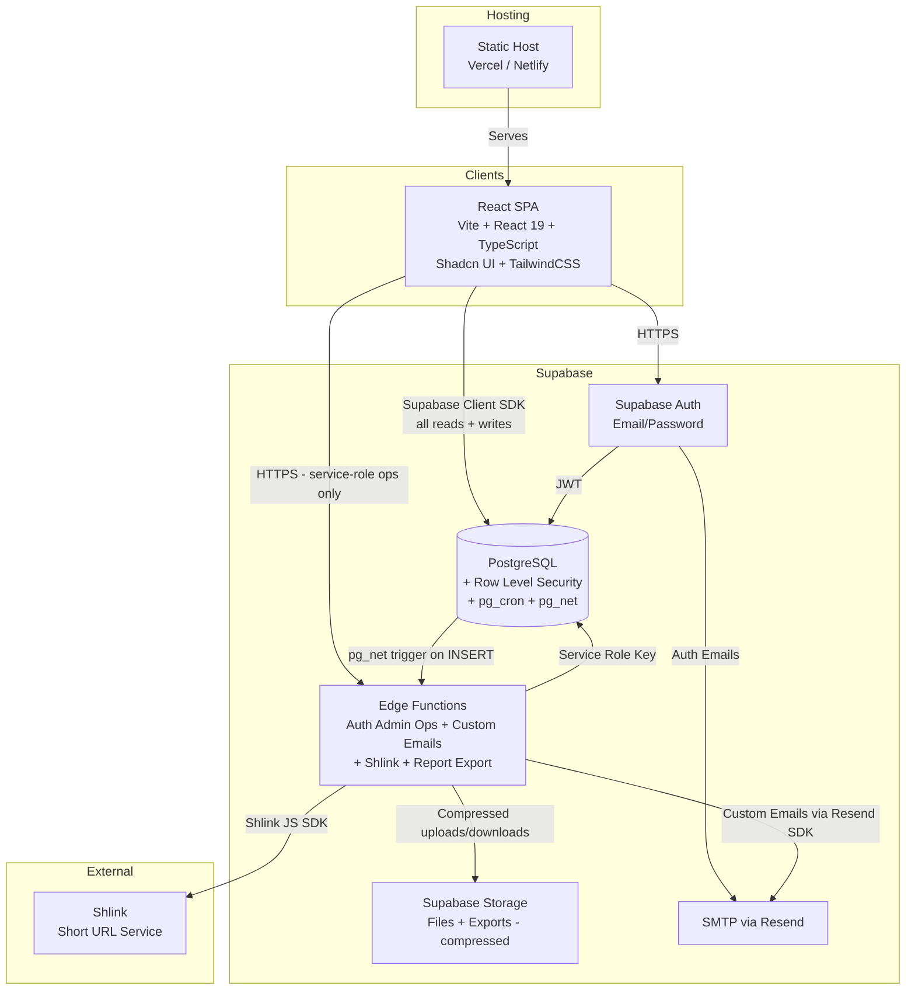

# RoyalForms - System Design

## Overview

RoyalForms is an internal web application for structured form creation, collaborative form filling, and reporting.

- **Architecture style:** SPA + BaaS (Backend-as-a-Service). Supabase Client SDK for all Postgres reads/writes (protected by RLS). Edge Functions reserved for operations requiring the service role key (auth admin API, custom emails, short URL generation).
- **Single-tenant:** One organization, multiple groups.
- **Collaboration model:** Save-based (no real-time editing).

## Subsystem Documents

| Document | Description |
|---|---|
| [Auth, RBAC & Groups](./auth-rbac.md) | Authentication, user provisioning, roles, groups, member requests |
| [Form System](./form-system.md) | Templates, versioning, sections, fields, instances, scheduling, audit trail |
| [Reporting System](./reporting.md) | Report templates, instances, formulas, export (PDF/Word), auto-generation |
| [RLS Policy Definitions](./rls-policies.md) | Row Level Security policies for every table, helper functions, summary matrix |
| [Frontend Architecture](./frontend.md) | Routing, layout, pages, UI patterns, state management, project structure |
| [Edge Function Inventory](./edge-functions.md) | All Edge Functions, database triggers, pg_cron jobs, environment variables |

## Architecture Diagram

## Components

| Component | Technology | Responsibility |
|---|---|---|
| **Frontend SPA** | React 19, Vite 7, TypeScript, Shadcn UI, TailwindCSS | UI rendering, client-side routing, form interactions |
| **Authentication** | Supabase Auth | Email/password login, session management, JWT issuance |
| **Edge Functions** | Supabase Edge Functions (Deno) | Operations requiring service role key: user invites, role updates, Root Admin bootstrap, custom emails (Resend SDK), report computation and generation (`generate-report`), report export (PDF/Word). Also triggered by database via pg_net for post-creation tasks (short URL generation via Shlink SDK) and auto-report generation. |
| **Database** | PostgreSQL (Supabase-hosted) | Data persistence, RLS as primary authorization layer, pg_cron for scheduled instance creation, pg_net for triggering Edge Functions on data events (INSERT triggers for short URLs, UPDATE trigger on form submission for auto-report generation) |
| **Storage** | Supabase Storage | File uploads (form fields), report exports (PDF/Word). All objects compressed before upload. |
| **Email** | Resend (SMTP for Supabase Auth, SDK for custom emails) | Invite emails, password resets, notifications |
| **Short URLs** | Shlink (self-hosted or cloud) | Abbreviated links for form and report instances |
| **Static Hosting** | Vercel / Netlify | Serves the built SPA assets |

## Data Flow

1. User authenticates via Supabase Auth and receives a JWT.
2. SPA performs all Postgres reads and writes through the Supabase Client SDK. RLS policies enforce authorization based on the authenticated user's role and group.
3. For operations requiring the service role key (user invites, role changes, custom emails), the SPA calls an Edge Function directly.
4. When a new form or report instance is inserted (by Client SDK or pg_cron), a database trigger fires and invokes an Edge Function via pg_net to handle post-creation tasks (short URL generation via Shlink SDK).
5. pg_cron runs scheduled jobs to automatically create form instances on configured schedules.
6. SPA receives responses and updates the UI.

## Key Architectural Decisions

| Decision | Rationale |
|---|---|
| **Client SDK for all Postgres reads and writes** | Forms, submissions, templates, field values -- all go through the Supabase Client SDK. RLS policies are the primary authorization layer. **Exception:** report instance creation goes through an Edge Function (`generate-report`) because formula resolution requires server-side computation across multiple form instances. |
| **Edge Functions only for service-role operations** | Reserved for: `inviteUserByEmail`, `updateUserById`, Root Admin bootstrap, custom email sending (Resend SDK), report generation (`generate-report`), report export. Also invoked by database triggers via pg_net for short URLs and auto-report generation. Not a general-purpose API. |
| **RLS as primary authorization** | RLS policies carry the full weight of authorization for all data operations. Edge Functions only handle operations that cannot go through the client SDK. |
| **Database triggers for post-creation and submission tasks** | INSERT triggers on `form_instances` and `report_instances` invoke Edge Functions via pg_net for short URL generation. An AFTER UPDATE trigger on `form_instances` (status -> submitted) invokes the `generate-report` Edge Function for auto-report generation. |
| **pg_cron for scheduled instance creation** | Database-level cron for creating form instances on schedule. No external scheduler needed. |
| **No custom backend server** | Supabase provides auth, database, and serverless compute. No Express/Fastify server to maintain. |
| **Save-based collaboration, no realtime** | Forms use save-based collaboration. Realtime can be added later for notifications if needed. |

---

## Storage Policy

All objects stored in Supabase Storage are **compressed** before upload to save on space. This applies to:

- Form field file uploads
- Report exports (PDF, Word)
- Any future file storage

Compression is handled at the application layer (Edge Function or client) before calling the Supabase Storage upload API.
