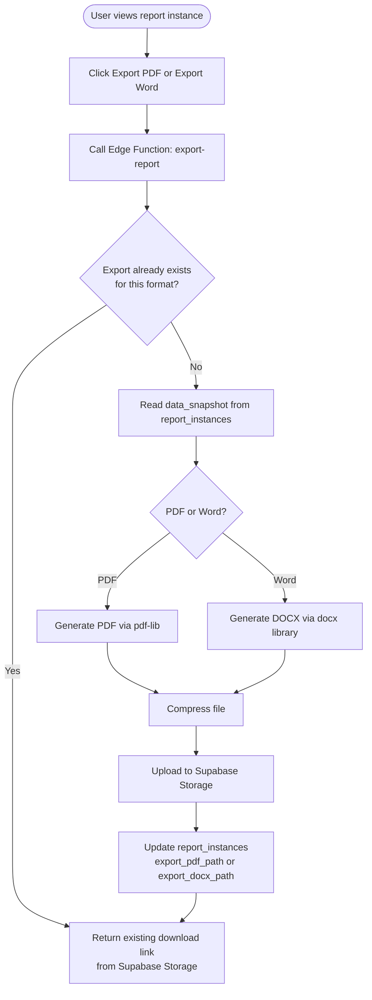
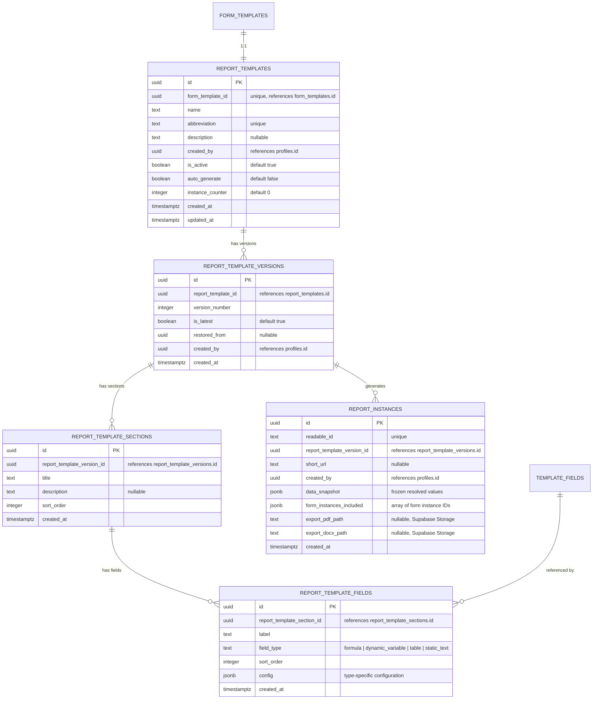
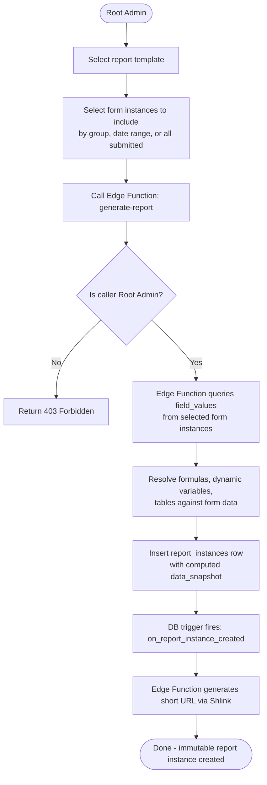
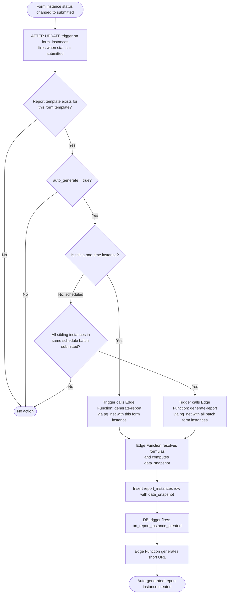
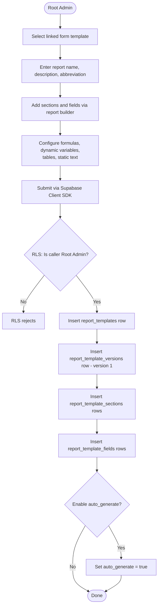
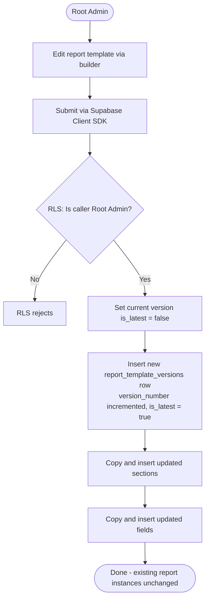

# Reporting System

[Back to System Design Index](./index.md)

---

## 1. Overview

Reports aggregate data from submitted form instances. A report template is tied 1:1 to a form template. Report instances are immutable snapshots of resolved data -- any changes require a new instance. All authenticated platform users can view a report instance if they have the link (no role-based restriction). Reports are exportable as PDF or Word documents.

---

## 2. Core Concepts

| Concept | Description |
|---|---|
| **Report Template** | Defines the structure of a report: title, description, abbreviation, sections with fields. Tied 1:1 to a form template. Created by Root Admin only. Versioned on edit (same pattern as form templates). |
| **Report Template Version** | Snapshot of report template at a point in time. Existing report instances stay pinned to their version. Restore creates a new version with old content (full history preserved). |
| **Report Instance** | An immutable snapshot generated from a report template version + submitted form instance data. Cannot be edited -- create a new instance for changes. |
| **Report Field** | An element in the report template. Types: formula, dynamic variable, table, static text. |

---

## 3. Report Template Management

- Only Root Admin can create, edit, delete, and restore report templates.
- A report template is tied to exactly one form template (1:1).
- Report templates have a **name**, **description**, and **abbreviation** (for instance IDs and short URLs).
- Versioning follows the same pattern as form templates: version-on-edit, existing instances pinned, restore creates a new version.
- A report template can reference fields from **any version** of the linked form template, but fields from different versions are represented as distinct references (even if just a rename). This keeps things simple and unambiguous.
- A report template can be created at any time after the linked form template exists.

---

## 4. Report Field Types

| Field Type | Description | Config Structure |
|---|---|---|
| **Formula** | Aggregate + arithmetic on form field values across submitted instances | `{ "expression": "AVERAGE(field_uuid) / COUNT(field_uuid) * 100", "referenced_fields": ["field_uuid_1", "field_uuid_2"] }` |
| **Dynamic Variable** | A single value pulled from a specific form field | `{ "template_field_id": "field_uuid", "template_version_id": "version_uuid" }` |
| **Table** | Rows from form instances with form fields as columns (e.g., comparing values across groups) | `{ "columns": [{"template_field_id": "field_uuid", "label": "Column Name"}], "group_by": "group" }` |
| **Static Text** | Plain or rich text that does not depend on form data | `{ "content": "
Some text
", "format": "html" }` |

---

## 5. Supported Formulas

### Aggregate Functions

Applied to a single form field across submitted instances:

| Function | Description |
|---|---|
| `SUM(field)` | Sum of all values |
| `AVERAGE(field)` | Mean of all values |
| `MIN(field)` | Minimum value |
| `MAX(field)` | Maximum value |
| `COUNT(field)` | Count of non-null values |
| `MEDIAN(field)` | Median value |

### Arithmetic Operators

For combining aggregates and constants: `+`, `-`, `*`, `/`

### Example Expressions

- `AVERAGE(monthly_revenue)`
- `SUM(hours_worked) / COUNT(employees)`
- `MAX(score) - MIN(score)`
- `AVERAGE(score) * 100 / MAX(score)`

---

## 6. Report Instance Creation

### Computation Model

Report instance creation is handled by an **Edge Function** (`generate-report`). This is an exception to the "Client SDK for all writes" rule because formula resolution (aggregating across multiple form instances) requires server-side computation. The Edge Function:

1. Receives the report template version ID + list of form instance IDs.
2. Queries `field_values` across the specified form instances using the service role key.
3. Resolves all formulas (SUM, AVERAGE, etc.), dynamic variables, and table data.
4. Inserts the `report_instances` row with the computed `data_snapshot`.

### Three Modes

**1. Manual / On-demand**
- Root Admin calls the `generate-report` Edge Function with selected form instances (by group, date range, or all submitted).

**2. Automatic (on form completion)**
- If a report template exists for a form template with `auto_generate = true`:
  - When all form instances from a schedule run are submitted, a report instance is auto-generated.
  - When a one-time form instance is submitted, a report instance is auto-generated.
- Triggered by a **separate AFTER UPDATE trigger** on `form_instances` that fires when `status` changes to `submitted`. The trigger checks completion conditions and calls the `generate-report` Edge Function via pg_net.

**3. Historical**
- Root Admin can create a report instance from previously submitted form instances, including instances from older form template versions.
- Fields from different template versions are represented as distinct references in the report.

### Instance Immutability

- Report instances are **immutable**. Once created, they cannot be edited.
- If changes are needed (different data selection, updated template), a new report instance must be created.
- Each instance captures a `data_snapshot` -- a frozen copy of all resolved field values at creation time.

---

## 7. Short URLs

- Short URLs generated via Shlink JS SDK, called from an Edge Function triggered by a database trigger on `report_instances` INSERT (same pattern as form instances).
- Format: `https://short.domain/report/{abbreviation}-{NNN}` (e.g., `report/epr-r-001`)

---

## 8. Access Control

- **Report templates**: Only Root Admin can create, edit, delete, restore, view versions.
- **Report instances**: Any authenticated platform user with the link can view. No role-based restriction on viewing.
- Short URLs resolve to the report viewer. Authentication is still required -- unauthenticated users are redirected to login.

---

## 9. Export

- Report instances can be exported as **PDF** or **Word** (`.docx`).
- Export is generated server-side in an **Edge Function** using `pdf-lib` (PDF) or `docx` library (Word).
- Generated files are **compressed** before being stored in **Supabase Storage** (see [Storage Policy](./index.md#storage-policy)).
- **Export caching**: Since report instances are immutable, an export is generated only once per format. If `export_pdf_path` or `export_docx_path` is already set on the report instance, the Edge Function returns the existing download link without re-generating.
- Export is triggered on demand by the user viewing the report.

### Export Flow

---

## 10. Database Schema

### Entity Relationship Diagram

### Table Details

#### `report_templates`

| Column | Type | Constraints | Description |
|---|---|---|---|
| `id` | UUID | PK | |
| `form_template_id` | UUID | NOT NULL, UNIQUE, FK -> `form_templates.id` | 1:1 link to form template |
| `name` | TEXT | NOT NULL | Report display name |
| `abbreviation` | TEXT | NOT NULL, UNIQUE | Short form for IDs/URLs |
| `description` | TEXT | NULLABLE | |
| `created_by` | UUID | NOT NULL, FK -> `profiles.id` | Root Admin |
| `is_active` | BOOLEAN | NOT NULL, DEFAULT true | Soft-delete |
| `auto_generate` | BOOLEAN | NOT NULL, DEFAULT false | Auto-generate on form completion |
| `instance_counter` | INTEGER | NOT NULL, DEFAULT 0 | Sequential counter |
| `created_at` | TIMESTAMPTZ | NOT NULL, DEFAULT now() | |
| `updated_at` | TIMESTAMPTZ | NOT NULL, DEFAULT now() | |

#### `report_template_versions`

| Column | Type | Constraints | Description |
|---|---|---|---|
| `id` | UUID | PK | |
| `report_template_id` | UUID | NOT NULL, FK -> `report_templates.id` | |
| `version_number` | INTEGER | NOT NULL | Auto-incrementing per template |
| `is_latest` | BOOLEAN | NOT NULL, DEFAULT true | |
| `restored_from` | UUID | NULLABLE, FK -> `report_template_versions.id` | |
| `created_by` | UUID | NOT NULL, FK -> `profiles.id` | |
| `created_at` | TIMESTAMPTZ | NOT NULL, DEFAULT now() | |

Unique constraint on (`report_template_id`, `version_number`).

#### `report_template_sections`

| Column | Type | Constraints | Description |
|---|---|---|---|
| `id` | UUID | PK | |
| `report_template_version_id` | UUID | NOT NULL, FK -> `report_template_versions.id` | |
| `title` | TEXT | NOT NULL | Section title |
| `description` | TEXT | NULLABLE | |
| `sort_order` | INTEGER | NOT NULL | |
| `created_at` | TIMESTAMPTZ | NOT NULL, DEFAULT now() | |

#### `report_template_fields`

| Column | Type | Constraints | Description |
|---|---|---|---|
| `id` | UUID | PK | |
| `report_template_section_id` | UUID | NOT NULL, FK -> `report_template_sections.id` | |
| `label` | TEXT | NOT NULL | Field display label |
| `field_type` | TEXT | NOT NULL, CHECK | `formula`, `dynamic_variable`, `table`, `static_text` |
| `sort_order` | INTEGER | NOT NULL | |
| `config` | JSONB | NOT NULL | Type-specific configuration |
| `created_at` | TIMESTAMPTZ | NOT NULL, DEFAULT now() | |

#### `report_instances`

| Column | Type | Constraints | Description |
|---|---|---|---|
| `id` | UUID | PK | |
| `readable_id` | TEXT | NOT NULL, UNIQUE | e.g., `epr-r-001` |
| `report_template_version_id` | UUID | NOT NULL, FK -> `report_template_versions.id` | Pinned version |
| `short_url` | TEXT | NULLABLE | Shlink short URL |
| `created_by` | UUID | NOT NULL, FK -> `profiles.id` | Root Admin or system |
| `data_snapshot` | JSONB | NOT NULL | Frozen snapshot of all resolved field values |
| `form_instances_included` | JSONB | NOT NULL | Array of form instance IDs that contributed data |
| `export_pdf_path` | TEXT | NULLABLE | Supabase Storage path (compressed) |
| `export_docx_path` | TEXT | NULLABLE | Supabase Storage path (compressed) |
| `created_at` | TIMESTAMPTZ | NOT NULL, DEFAULT now() | |

No `updated_at` -- instances are immutable.

---

## 11. Activity Diagrams

### 11.1 Manual Report Instance Creation

### 11.2 Auto-Generated Report Instance

### 11.3 Report Template Creation

### 11.4 Report Template Edit (New Version)

---

## 12. Access Rules Summary

| Action | Who |
|---|---|
| Create/edit/delete/restore report template | Root Admin only |
| View report template versions | Root Admin only |
| Create report instance (manual/historical) | Root Admin only |
| View report instance | Any authenticated user with the link |
| Export report instance (PDF/Word) | Any authenticated user with the link |
